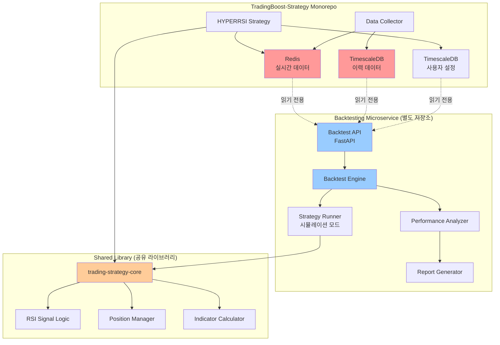
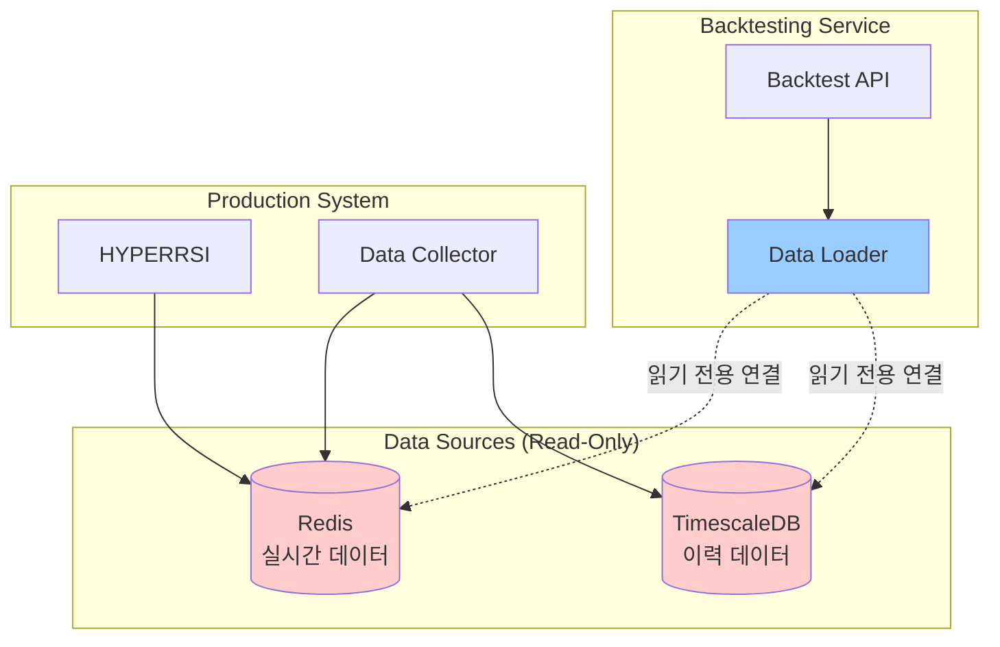
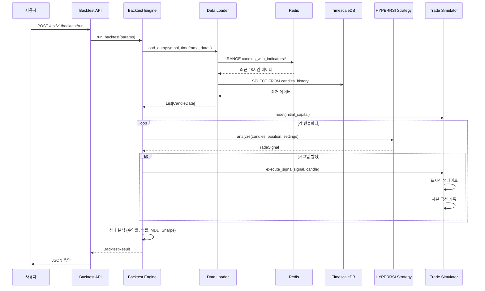

# BACKTEST_ARCHITECTURE.md

백테스팅 마이크로서비스 아키텍처 설계 문서

---

## 📋 Executive Summary

이 문서는 TradingBoost-Strategy 모노레포와 **독립적으로 운영**되는 백테스팅 마이크로서비스의 아키텍처를 정의합니다. 백테스팅 시스템은 기존 트레이딩 로직을 재사용하면서도, 별도의 Git 저장소로 분리하여 배포 및 확장성을 보장합니다.

**핵심 설계 원칙:**
- ✅ **독립성**: 별도 Git 저장소, 독립 배포
- ✅ **데이터 격리**: 읽기 전용 Redis/TimescaleDB 접근
- ✅ **로직 재사용**: 공유 라이브러리로 트레이딩 로직 추출
- ✅ **확장성**: 병렬 백테스팅, 파라미터 최적화 지원
- ✅ **API 우선**: FastAPI 기반 RESTful 인터페이스

---

## 1. 시스템 아키텍처 개요

### 1.1 전체 시스템 구조



**설명:**
- **TradingBoost-Strategy**: 기존 실시간 트레이딩 시스템 (변경 최소화)
- **Backtesting Microservice**: 새로운 독립 서비스 (별도 Git 저장소)
- **Shared Library**: 트레이딩 로직 공유 (PyPI 패키지 또는 Git submodule)

---

### 1.2 저장소 구조

#### 옵션 1: 멀티 레포지토리 (권장)

```
📦 TradingBoost-Strategy/          # 기존 모노레포
├── HYPERRSI/
├── GRID/
└── shared/

📦 trading-strategy-core/          # 공유 라이브러리 (새 저장소)
├── src/
│   ├── signals/
│   │   ├── rsi.py
│   │   └── trend.py
│   ├── position/
│   │   └── manager.py
│   └── indicators/
│       └── calculator.py
├── tests/
├── pyproject.toml
└── README.md

📦 trading-backtest-service/       # 백테스팅 서비스 (새 저장소)
├── app/
│   ├── api/
│   │   └── routes/
│   ├── core/
│   │   ├── backtest_engine.py
│   │   └── data_loader.py
│   ├── models/
│   └── services/
├── tests/
├── docker-compose.yml
├── Dockerfile
└── README.md
```

**장점:**
- 독립적 버전 관리
- 각 저장소별 CI/CD 파이프라인
- 명확한 의존성 관리

---

#### 옵션 2: 모노레포 확장 (간편하지만 덜 권장)

```
📦 TradingBoost-Strategy/
├── HYPERRSI/
├── GRID/
├── shared/
├── backtest-service/              # 새 디렉토리
│   ├── app/
│   ├── tests/
│   └── docker-compose.yml
└── trading-core/                  # 공유 라이브러리
    ├── src/
    └── tests/
```

**단점:**
- 모노레포 크기 증가
- 배포 복잡도 증가
- 독립성 저하

**권장:** **옵션 1 (멀티 레포지토리)** 사용

---

## 2. 공유 라이브러리 설계 (trading-strategy-core)

### 2.1 추출할 로직 목록

현재 `HYPERRSI/src/trading/execute_trading_logic.py`에서 추출할 핵심 로직:

| 로직 | 현재 위치 | 추출 후 위치 |
|------|---------|------------|
| RSI 시그널 분석 | `execute_trading_logic.py:491` | `trading_core/signals/rsi.py` |
| 트렌드 상태 계산 | `Calculate_signal.py:309` | `trading_core/signals/trend.py` |
| 포지션 관리 | `position_handler.py` | `trading_core/position/manager.py` |
| 지표 계산 | `shared/indicators/` | `trading_core/indicators/` (복사) |
| 진입/청산 로직 | `handle_no_position()`, `handle_existing_position()` | `trading_core/strategy/entry_exit.py` |

---

### 2.2 공유 라이브러리 구조

```
📦 trading-strategy-core/
├── pyproject.toml
├── README.md
├── src/
│   └── trading_core/
│       ├── __init__.py
│       ├── config/
│       │   ├── __init__.py
│       │   └── settings.py              # 전략 기본 설정
│       ├── signals/
│       │   ├── __init__.py
│       │   ├── rsi.py                   # RSI 시그널 로직
│       │   ├── trend.py                 # 트렌드 분석
│       │   └── base.py                  # 시그널 추상 클래스
│       ├── position/
│       │   ├── __init__.py
│       │   ├── manager.py               # 포지션 관리
│       │   └── models.py                # Position 데이터 모델
│       ├── indicators/
│       │   ├── __init__.py
│       │   ├── rsi.py                   # RSI 계산
│       │   ├── atr.py                   # ATR 계산
│       │   └── all_indicators.py        # 통합 계산
│       ├── strategy/
│       │   ├── __init__.py
│       │   ├── base.py                  # Strategy 추상 클래스
│       │   ├── hyperrsi.py              # HYPERRSI 전략
│       │   └── entry_exit.py            # 진입/청산 로직
│       └── utils/
│           ├── __init__.py
│           └── time_helpers.py          # 시간 유틸리티
└── tests/
    ├── test_signals.py
    ├── test_position.py
    └── test_strategy.py
```

---

### 2.3 핵심 클래스 설계

#### A. RSI Signal Analyzer (추출 예시)

**현재 코드 (execute_trading_logic.py):**

```python
# execute_trading_logic.py:491-497
rsi_signals = await trading_service.check_rsi_signals(
    rsi_values,
    {
        'entry_option': user_settings['entry_option'],
        'rsi_oversold': user_settings['rsi_oversold'],
        'rsi_overbought': user_settings['rsi_overbought']
    }
)
```

**추출 후 (trading_core/signals/rsi.py):**

```python
# trading-strategy-core/src/trading_core/signals/rsi.py

from typing import List, Dict, Literal
from pydantic import BaseModel, Field

class RSISignalConfig(BaseModel):
    """RSI 시그널 설정"""
    entry_option: Literal["reverse", "follow"] = "reverse"
    rsi_oversold: float = Field(default=30, ge=0, le=100)
    rsi_overbought: float = Field(default=70, ge=0, le=100)

class RSISignalResult(BaseModel):
    """RSI 시그널 결과"""
    signal: Literal["long", "short", "neutral"]
    current_rsi: float
    previous_rsi: float
    reason: str

class RSISignalAnalyzer:
    """
    RSI 기반 시그널 분석기

    HYPERRSI/src/trading/trading_service.py:check_rsi_signals 로직 추출
    """

    def __init__(self, config: RSISignalConfig):
        self.config = config

    def analyze(self, rsi_values: List[float]) -> RSISignalResult:
        """
        RSI 값 배열을 분석하여 진입 시그널 생성

        Args:
            rsi_values: RSI 값 배열 (최소 2개 이상)

        Returns:
            RSISignalResult: 시그널 결과
        """
        if len(rsi_values) < 2:
            raise ValueError("RSI 값이 최소 2개 이상 필요합니다")

        current_rsi = rsi_values[-1]
        previous_rsi = rsi_values[-2]

        # 역추세 전략
        if self.config.entry_option == "reverse":
            # 과매도 -> 롱
            if previous_rsi <= self.config.rsi_oversold and current_rsi > self.config.rsi_oversold:
                return RSISignalResult(
                    signal="long",
                    current_rsi=current_rsi,
                    previous_rsi=previous_rsi,
                    reason=f"RSI 과매도 반등: {previous_rsi:.2f} -> {current_rsi:.2f}"
                )

            # 과매수 -> 숏
            if previous_rsi >= self.config.rsi_overbought and current_rsi < self.config.rsi_overbought:
                return RSISignalResult(
                    signal="short",
                    current_rsi=current_rsi,
                    previous_rsi=previous_rsi,
                    reason=f"RSI 과매수 하락: {previous_rsi:.2f} -> {current_rsi:.2f}"
                )

        # 순추세 전략
        elif self.config.entry_option == "follow":
            # RSI 상승 돌파 -> 롱
            if previous_rsi < self.config.rsi_oversold and current_rsi >= self.config.rsi_oversold:
                return RSISignalResult(
                    signal="long",
                    current_rsi=current_rsi,
                    previous_rsi=previous_rsi,
                    reason=f"RSI 상승 돌파: {previous_rsi:.2f} -> {current_rsi:.2f}"
                )

            # RSI 하락 돌파 -> 숏
            if previous_rsi > self.config.rsi_overbought and current_rsi <= self.config.rsi_overbought:
                return RSISignalResult(
                    signal="short",
                    current_rsi=current_rsi,
                    previous_rsi=previous_rsi,
                    reason=f"RSI 하락 돌파: {previous_rsi:.2f} -> {current_rsi:.2f}"
                )

        # 시그널 없음
        return RSISignalResult(
            signal="neutral",
            current_rsi=current_rsi,
            previous_rsi=previous_rsi,
            reason="조건 미충족"
        )
```

---

#### B. Strategy Base Class

```python
# trading-strategy-core/src/trading_core/strategy/base.py

from abc import ABC, abstractmethod
from typing import Dict, List, Optional
from pydantic import BaseModel

class Candle(BaseModel):
    """캔들 데이터 모델"""
    timestamp: int
    open: float
    high: float
    low: float
    close: float
    volume: float
    rsi: Optional[float] = None
    atr: Optional[float] = None

class Position(BaseModel):
    """포지션 데이터 모델"""
    side: Literal["long", "short"]
    entry_price: float
    contracts_amount: float
    leverage: float
    unrealized_pnl: float = 0.0

class TradeSignal(BaseModel):
    """거래 시그널"""
    action: Literal["open_long", "open_short", "close_long", "close_short", "hold"]
    reason: str
    metadata: Dict = {}

class TradingStrategy(ABC):
    """
    트레이딩 전략 추상 클래스

    모든 전략은 이 클래스를 상속받아 구현
    """

    @abstractmethod
    def analyze(
        self,
        candles: List[Candle],
        current_position: Optional[Position],
        user_settings: Dict
    ) -> TradeSignal:
        """
        시장 상황을 분석하여 거래 시그널 생성

        Args:
            candles: 캔들 데이터 배열 (최소 14개 이상)
            current_position: 현재 포지션 (없으면 None)
            user_settings: 사용자 설정

        Returns:
            TradeSignal: 거래 시그널
        """
        pass

    @abstractmethod
    def validate_settings(self, settings: Dict) -> bool:
        """사용자 설정 유효성 검증"""
        pass
```

---

#### C. HYPERRSI Strategy Implementation

```python
# trading-strategy-core/src/trading_core/strategy/hyperrsi.py

from typing import Dict, List, Optional
from .base import TradingStrategy, Candle, Position, TradeSignal
from ..signals.rsi import RSISignalAnalyzer, RSISignalConfig
from ..signals.trend import TrendAnalyzer

class HYPERRSIStrategy(TradingStrategy):
    """
    HYPERRSI 전략 구현

    RSI + 트렌드 기반 역추세/순추세 전략
    """

    def __init__(self):
        self.rsi_analyzer: Optional[RSISignalAnalyzer] = None
        self.trend_analyzer = TrendAnalyzer()

    def analyze(
        self,
        candles: List[Candle],
        current_position: Optional[Position],
        user_settings: Dict
    ) -> TradeSignal:
        """
        HYPERRSI 전략 분석

        execute_trading_logic.py의 로직을 추상화
        """
        # 설정 초기화
        if not self.rsi_analyzer:
            config = RSISignalConfig(
                entry_option=user_settings.get('entry_option', 'reverse'),
                rsi_oversold=user_settings.get('rsi_oversold', 30),
                rsi_overbought=user_settings.get('rsi_overbought', 70)
            )
            self.rsi_analyzer = RSISignalAnalyzer(config)

        # RSI 값 추출
        rsi_values = [c.rsi for c in candles if c.rsi is not None]
        if len(rsi_values) < 2:
            return TradeSignal(action="hold", reason="RSI 데이터 부족")

        # RSI 시그널 분석
        rsi_signal = self.rsi_analyzer.analyze(rsi_values)

        # 트렌드 분석
        trend_state = self.trend_analyzer.analyze(candles)

        # 포지션 없음 -> 진입 검토
        if not current_position:
            if rsi_signal.signal == "long":
                return TradeSignal(
                    action="open_long",
                    reason=f"{rsi_signal.reason} | 트렌드: {trend_state}",
                    metadata={
                        "rsi": rsi_signal.current_rsi,
                        "trend": trend_state
                    }
                )
            elif rsi_signal.signal == "short":
                return TradeSignal(
                    action="open_short",
                    reason=f"{rsi_signal.reason} | 트렌드: {trend_state}",
                    metadata={
                        "rsi": rsi_signal.current_rsi,
                        "trend": trend_state
                    }
                )

        # 포지션 있음 -> 청산 검토
        else:
            # TP/SL 체크 (여기서는 간소화)
            if self._check_exit_condition(candles[-1], current_position, user_settings):
                action = "close_long" if current_position.side == "long" else "close_short"
                return TradeSignal(
                    action=action,
                    reason="청산 조건 충족",
                    metadata={"unrealized_pnl": current_position.unrealized_pnl}
                )

        return TradeSignal(action="hold", reason="조건 미충족")

    def validate_settings(self, settings: Dict) -> bool:
        """설정 유효성 검증"""
        required = ['entry_option', 'rsi_oversold', 'rsi_overbought']
        return all(k in settings for k in required)

    def _check_exit_condition(
        self,
        current_candle: Candle,
        position: Position,
        settings: Dict
    ) -> bool:
        """청산 조건 체크 (간소화 버전)"""
        # 실제로는 TP/SL, 트레일링 스톱 등 복잡한 로직
        # 여기서는 예시만 제공
        return False
```

---

### 2.4 패키지 배포 전략

#### PyPI 패키지로 배포 (권장)

**pyproject.toml:**

```toml
[build-system]
requires = ["setuptools>=61.0", "wheel"]
build-backend = "setuptools.build_meta"

[project]
name = "trading-strategy-core"
version = "0.1.0"
description = "Shared trading strategy logic for HYPERRSI and backtesting"
authors = [
    {name = "TradingBoost Team", email = "team@tradingboost.com"}
]
dependencies = [
    "pydantic>=2.0.0",
    "pandas>=2.0.0",
    "numpy>=1.24.0",
]

[project.optional-dependencies]
dev = [
    "pytest>=7.0.0",
    "pytest-asyncio>=0.21.0",
    "black>=23.0.0",
    "mypy>=1.0.0",
]
```

**설치 및 사용:**

```bash
# TradingBoost-Strategy에서 사용
cd TradingBoost-Strategy/HYPERRSI
pip install trading-strategy-core==0.1.0

# Backtesting Service에서 사용
cd trading-backtest-service
pip install trading-strategy-core==0.1.0
```

---

## 3. 백테스팅 마이크로서비스 설계

### 3.1 서비스 구조

```
📦 trading-backtest-service/
├── app/
│   ├── __init__.py
│   ├── main.py                      # FastAPI 애플리케이션
│   ├── api/
│   │   ├── __init__.py
│   │   └── routes/
│   │       ├── backtest.py          # 백테스팅 엔드포인트
│   │       ├── optimization.py      # 파라미터 최적화
│   │       └── health.py            # 헬스체크
│   ├── core/
│   │   ├── __init__.py
│   │   ├── config.py                # 설정 관리
│   │   ├── backtest_engine.py       # 백테스팅 엔진
│   │   ├── data_loader.py           # 데이터 로더
│   │   └── simulator.py             # 거래 시뮬레이터
│   ├── models/
│   │   ├── __init__.py
│   │   ├── request.py               # API 요청 모델
│   │   ├── response.py              # API 응답 모델
│   │   └── backtest.py              # 백테스트 내부 모델
│   ├── services/
│   │   ├── __init__.py
│   │   ├── performance.py           # 성과 분석
│   │   ├── report.py                # 리포트 생성
│   │   └── optimization.py          # 파라미터 최적화
│   └── utils/
│       ├── __init__.py
│       └── validators.py
├── tests/
│   ├── test_backtest_engine.py
│   ├── test_data_loader.py
│   └── test_performance.py
├── docker/
│   ├── Dockerfile
│   └── docker-compose.yml
├── requirements.txt
├── pyproject.toml
└── README.md
```

---

### 3.2 핵심 컴포넌트 설계

#### A. Data Loader (데이터 로더)

**역할:** Redis 또는 TimescaleDB에서 백테스팅 데이터 로드

```python
# app/core/data_loader.py

from typing import List, Dict, Optional
from datetime import datetime
import json
import asyncpg
from redis.asyncio import Redis
from pydantic import BaseModel

class CandleData(BaseModel):
    """캔들 데이터 모델"""
    timestamp: int
    open: float
    high: float
    low: float
    close: float
    volume: float
    rsi: Optional[float] = None
    atr: Optional[float] = None
    ema: Optional[float] = None
    sma: Optional[float] = None

class DataLoader:
    """
    백테스팅 데이터 로더

    Redis (단기) 또는 TimescaleDB (장기) 에서 데이터 조회
    """

    def __init__(
        self,
        redis: Redis,
        db_pool: Optional[asyncpg.Pool] = None
    ):
        self.redis = redis
        self.db_pool = db_pool

    async def load_data(
        self,
        symbol: str,
        timeframe: str,
        start_date: datetime,
        end_date: datetime,
        use_hybrid: bool = True
    ) -> List[CandleData]:
        """
        백테스팅 데이터 로드

        Args:
            symbol: 심볼 (예: BTC-USDT-SWAP)
            timeframe: 타임프레임 (예: 1m, 1h)
            start_date: 시작 날짜
            end_date: 종료 날짜
            use_hybrid: 하이브리드 전략 사용 (Redis + DB)

        Returns:
            List[CandleData]: 캔들 데이터 배열
        """
        if use_hybrid and self.db_pool:
            return await self._load_hybrid(symbol, timeframe, start_date, end_date)
        elif self.db_pool:
            return await self._load_from_db(symbol, timeframe, start_date, end_date)
        else:
            return await self._load_from_redis(symbol, timeframe, start_date, end_date)

    async def _load_from_redis(
        self,
        symbol: str,
        timeframe: str,
        start_date: datetime,
        end_date: datetime
    ) -> List[CandleData]:
        """Redis에서 데이터 로드"""
        key = f"candles_with_indicators:{symbol}:{timeframe}"
        raw_data = await self.redis.lrange(key, 0, -1)

        candles = []
        start_ts = int(start_date.timestamp())
        end_ts = int(end_date.timestamp())

        for item in raw_data:
            data = json.loads(item)
            if start_ts <= data['timestamp'] <= end_ts:
                candles.append(CandleData(**data))

        return sorted(candles, key=lambda x: x.timestamp)

    async def _load_from_db(
        self,
        symbol: str,
        timeframe: str,
        start_date: datetime,
        end_date: datetime
    ) -> List[CandleData]:
        """TimescaleDB에서 데이터 로드"""
        async with self.db_pool.acquire() as conn:
            rows = await conn.fetch(
                """
                SELECT
                    EXTRACT(EPOCH FROM timestamp)::bigint as timestamp,
                    open, high, low, close, volume,
                    rsi, atr, ema, sma
                FROM candles_history
                WHERE symbol = $1
                  AND timeframe = $2
                  AND timestamp >= $3
                  AND timestamp <= $4
                ORDER BY timestamp ASC
                """,
                symbol, timeframe, start_date, end_date
            )

        return [CandleData(**dict(row)) for row in rows]

    async def _load_hybrid(
        self,
        symbol: str,
        timeframe: str,
        start_date: datetime,
        end_date: datetime
    ) -> List[CandleData]:
        """
        하이브리드 전략: Redis + TimescaleDB

        최근 48시간: Redis
        그 이전: TimescaleDB
        """
        cutoff = datetime.now() - timedelta(hours=48)
        candles = []

        # 오래된 데이터: DB 조회
        if start_date < cutoff:
            db_end = min(cutoff, end_date)
            db_candles = await self._load_from_db(
                symbol, timeframe, start_date, db_end
            )
            candles.extend(db_candles)

        # 최근 데이터: Redis 조회
        if end_date > cutoff:
            redis_start = max(cutoff, start_date)
            redis_candles = await self._load_from_redis(
                symbol, timeframe, redis_start, end_date
            )
            candles.extend(redis_candles)

        return sorted(candles, key=lambda x: x.timestamp)
```

---

#### B. Backtest Engine (백테스팅 엔진)

```python
# app/core/backtest_engine.py

from typing import List, Dict, Optional
from datetime import datetime
from trading_core.strategy.hyperrsi import HYPERRSIStrategy
from trading_core.strategy.base import Candle, Position, TradeSignal
from .data_loader import DataLoader, CandleData
from .simulator import TradeSimulator

class BacktestResult(BaseModel):
    """백테스팅 결과"""
    total_return: float
    win_rate: float
    max_drawdown: float
    sharpe_ratio: float
    total_trades: int
    winning_trades: int
    losing_trades: int
    trades: List[Dict]
    equity_curve: List[Dict]

class BacktestEngine:
    """
    백테스팅 엔진

    전략을 실행하고 결과를 분석
    """

    def __init__(
        self,
        data_loader: DataLoader,
        strategy: HYPERRSIStrategy
    ):
        self.data_loader = data_loader
        self.strategy = strategy
        self.simulator = TradeSimulator()

    async def run(
        self,
        symbol: str,
        timeframe: str,
        start_date: datetime,
        end_date: datetime,
        user_settings: Dict,
        initial_capital: float = 10000.0
    ) -> BacktestResult:
        """
        백테스팅 실행

        Args:
            symbol: 거래 심볼
            timeframe: 타임프레임
            start_date: 시작 날짜
            end_date: 종료 날짜
            user_settings: 전략 설정
            initial_capital: 초기 자본

        Returns:
            BacktestResult: 백테스팅 결과
        """
        # 1. 데이터 로드
        candles_data = await self.data_loader.load_data(
            symbol, timeframe, start_date, end_date
        )

        if len(candles_data) < 14:
            raise ValueError("백테스팅을 위한 충분한 데이터가 없습니다 (최소 14개 캔들 필요)")

        # 2. 시뮬레이터 초기화
        self.simulator.reset(initial_capital)

        # 3. 백테스팅 루프
        for i in range(14, len(candles_data)):
            # 현재까지의 캔들 데이터
            historical_candles = candles_data[:i+1]
            current_candle = candles_data[i]

            # Candle 모델로 변환
            candles = [
                Candle(**c.dict())
                for c in historical_candles[-30:]  # 최근 30개만 사용
            ]

            # 현재 포지션 조회
            current_position = self.simulator.get_current_position()

            # 전략 분석
            signal = self.strategy.analyze(
                candles,
                current_position,
                user_settings
            )

            # 시그널 실행
            if signal.action != "hold":
                self.simulator.execute_signal(
                    signal,
                    current_candle,
                    user_settings
                )

        # 4. 결과 분석
        return self._analyze_results()

    def _analyze_results(self) -> BacktestResult:
        """백테스팅 결과 분석"""
        trades = self.simulator.get_trade_history()
        equity_curve = self.simulator.get_equity_curve()

        # 성과 지표 계산
        total_return = self._calculate_total_return(equity_curve)
        win_rate = self._calculate_win_rate(trades)
        max_drawdown = self._calculate_max_drawdown(equity_curve)
        sharpe_ratio = self._calculate_sharpe_ratio(equity_curve)

        winning_trades = sum(1 for t in trades if t['pnl'] > 0)
        losing_trades = sum(1 for t in trades if t['pnl'] < 0)

        return BacktestResult(
            total_return=total_return,
            win_rate=win_rate,
            max_drawdown=max_drawdown,
            sharpe_ratio=sharpe_ratio,
            total_trades=len(trades),
            winning_trades=winning_trades,
            losing_trades=losing_trades,
            trades=trades,
            equity_curve=equity_curve
        )

    def _calculate_total_return(self, equity_curve: List[Dict]) -> float:
        """총 수익률 계산"""
        if not equity_curve:
            return 0.0
        initial = equity_curve[0]['equity']
        final = equity_curve[-1]['equity']
        return ((final - initial) / initial) * 100

    def _calculate_win_rate(self, trades: List[Dict]) -> float:
        """승률 계산"""
        if not trades:
            return 0.0
        winning = sum(1 for t in trades if t['pnl'] > 0)
        return (winning / len(trades)) * 100

    def _calculate_max_drawdown(self, equity_curve: List[Dict]) -> float:
        """최대 낙폭(MDD) 계산"""
        if not equity_curve:
            return 0.0

        peak = equity_curve[0]['equity']
        max_dd = 0.0

        for point in equity_curve:
            equity = point['equity']
            if equity > peak:
                peak = equity
            dd = ((peak - equity) / peak) * 100
            if dd > max_dd:
                max_dd = dd

        return max_dd

    def _calculate_sharpe_ratio(self, equity_curve: List[Dict]) -> float:
        """샤프 지수 계산"""
        if len(equity_curve) < 2:
            return 0.0

        # 일별 수익률 계산
        returns = []
        for i in range(1, len(equity_curve)):
            prev_equity = equity_curve[i-1]['equity']
            curr_equity = equity_curve[i]['equity']
            ret = (curr_equity - prev_equity) / prev_equity
            returns.append(ret)

        if not returns:
            return 0.0

        # 평균 수익률
        mean_return = sum(returns) / len(returns)

        # 표준편차
        variance = sum((r - mean_return) ** 2 for r in returns) / len(returns)
        std_dev = variance ** 0.5

        if std_dev == 0:
            return 0.0

        # 무위험 수익률 가정 (0%)
        risk_free_rate = 0.0

        # 샤프 지수 (연환산)
        sharpe = ((mean_return - risk_free_rate) / std_dev) * (365 ** 0.5)

        return sharpe
```

---

#### C. Trade Simulator (거래 시뮬레이터)

```python
# app/core/simulator.py

from typing import List, Dict, Optional
from datetime import datetime
from trading_core.strategy.base import TradeSignal, Position
from .data_loader import CandleData

class TradeSimulator:
    """
    거래 시뮬레이터

    백테스팅 중 실제 거래를 시뮬레이션
    """

    def __init__(self):
        self.initial_capital = 0.0
        self.current_capital = 0.0
        self.current_position: Optional[Position] = None
        self.trade_history: List[Dict] = []
        self.equity_curve: List[Dict] = []

    def reset(self, initial_capital: float):
        """시뮬레이터 초기화"""
        self.initial_capital = initial_capital
        self.current_capital = initial_capital
        self.current_position = None
        self.trade_history = []
        self.equity_curve = []

        # 초기 자본 기록
        self.equity_curve.append({
            'timestamp': int(datetime.now().timestamp()),
            'equity': self.current_capital
        })

    def get_current_position(self) -> Optional[Position]:
        """현재 포지션 조회"""
        return self.current_position

    def execute_signal(
        self,
        signal: TradeSignal,
        current_candle: CandleData,
        settings: Dict
    ):
        """시그널 실행"""
        if signal.action == "open_long":
            self._open_long(current_candle, settings)
        elif signal.action == "open_short":
            self._open_short(current_candle, settings)
        elif signal.action == "close_long":
            self._close_long(current_candle)
        elif signal.action == "close_short":
            self._close_short(current_candle)

        # 자본 곡선 기록
        self.equity_curve.append({
            'timestamp': current_candle.timestamp,
            'equity': self._calculate_total_equity(current_candle.close)
        })

    def _open_long(self, candle: CandleData, settings: Dict):
        """롱 포지션 진입"""
        if self.current_position:
            return  # 이미 포지션 있음

        investment = settings.get('investment', 100)
        leverage = settings.get('leverage', 10)
        entry_price = candle.close
        contracts = (investment * leverage) / entry_price

        self.current_position = Position(
            side="long",
            entry_price=entry_price,
            contracts_amount=contracts,
            leverage=leverage
        )

        # 진입 기록
        self.trade_history.append({
            'timestamp': candle.timestamp,
            'action': 'open_long',
            'price': entry_price,
            'contracts': contracts,
            'pnl': 0.0
        })

    def _close_long(self, candle: CandleData):
        """롱 포지션 청산"""
        if not self.current_position or self.current_position.side != "long":
            return

        exit_price = candle.close
        entry_price = self.current_position.entry_price
        contracts = self.current_position.contracts_amount

        # PnL 계산
        pnl = (exit_price - entry_price) * contracts
        self.current_capital += pnl

        # 청산 기록
        self.trade_history.append({
            'timestamp': candle.timestamp,
            'action': 'close_long',
            'price': exit_price,
            'contracts': contracts,
            'pnl': pnl
        })

        # 포지션 초기화
        self.current_position = None

    def _open_short(self, candle: CandleData, settings: Dict):
        """숏 포지션 진입"""
        # 롱과 유사하지만 반대 방향
        if self.current_position:
            return

        investment = settings.get('investment', 100)
        leverage = settings.get('leverage', 10)
        entry_price = candle.close
        contracts = (investment * leverage) / entry_price

        self.current_position = Position(
            side="short",
            entry_price=entry_price,
            contracts_amount=contracts,
            leverage=leverage
        )

        self.trade_history.append({
            'timestamp': candle.timestamp,
            'action': 'open_short',
            'price': entry_price,
            'contracts': contracts,
            'pnl': 0.0
        })

    def _close_short(self, candle: CandleData):
        """숏 포지션 청산"""
        if not self.current_position or self.current_position.side != "short":
            return

        exit_price = candle.close
        entry_price = self.current_position.entry_price
        contracts = self.current_position.contracts_amount

        # PnL 계산 (숏은 반대)
        pnl = (entry_price - exit_price) * contracts
        self.current_capital += pnl

        self.trade_history.append({
            'timestamp': candle.timestamp,
            'action': 'close_short',
            'price': exit_price,
            'contracts': contracts,
            'pnl': pnl
        })

        self.current_position = None

    def _calculate_total_equity(self, current_price: float) -> float:
        """총 자본 계산 (현금 + 미실현 손익)"""
        equity = self.current_capital

        if self.current_position:
            entry = self.current_position.entry_price
            contracts = self.current_position.contracts_amount

            if self.current_position.side == "long":
                unrealized_pnl = (current_price - entry) * contracts
            else:  # short
                unrealized_pnl = (entry - current_price) * contracts

            equity += unrealized_pnl

        return equity

    def get_trade_history(self) -> List[Dict]:
        """거래 내역 조회"""
        return self.trade_history

    def get_equity_curve(self) -> List[Dict]:
        """자본 곡선 조회"""
        return self.equity_curve
```

---

### 3.3 FastAPI 엔드포인트

```python
# app/api/routes/backtest.py

from fastapi import APIRouter, Depends, HTTPException, BackgroundTasks
from typing import Dict, Optional
from datetime import datetime
from pydantic import BaseModel, Field

from app.core.backtest_engine import BacktestEngine, BacktestResult
from app.core.data_loader import DataLoader
from trading_core.strategy.hyperrsi import HYPERRSIStrategy

router = APIRouter(prefix="/api/v1/backtest", tags=["backtest"])

class BacktestRequest(BaseModel):
    """백테스팅 요청"""
    symbol: str = Field(..., example="BTC-USDT-SWAP")
    timeframe: str = Field(..., example="1h")
    start_date: datetime
    end_date: datetime

    # 전략 설정
    entry_option: str = Field(default="reverse", example="reverse")
    rsi_oversold: float = Field(default=30, ge=0, le=100)
    rsi_overbought: float = Field(default=70, ge=0, le=100)
    leverage: float = Field(default=10, ge=1, le=125)
    investment: float = Field(default=100, ge=10)

    # 백테스팅 옵션
    initial_capital: float = Field(default=10000, ge=100)
    use_hybrid_data: bool = Field(default=True)

class BacktestResponse(BaseModel):
    """백테스팅 응답"""
    request_id: str
    status: str
    result: Optional[BacktestResult] = None

@router.post("/run", response_model=BacktestResponse)
async def run_backtest(
    request: BacktestRequest,
    data_loader: DataLoader = Depends(get_data_loader),
    background_tasks: BackgroundTasks = None
):
    """
    백테스팅 실행

    ## 예시 요청:
    ```json
    {
      "symbol": "BTC-USDT-SWAP",
      "timeframe": "1h",
      "start_date": "2025-10-01T00:00:00Z",
      "end_date": "2025-10-31T23:59:59Z",
      "entry_option": "reverse",
      "rsi_oversold": 30,
      "rsi_overbought": 70,
      "leverage": 10,
      "investment": 100,
      "initial_capital": 10000
    }
    ```

    ## 응답:
    - `total_return`: 총 수익률 (%)
    - `win_rate`: 승률 (%)
    - `max_drawdown`: 최대 낙폭 (%)
    - `sharpe_ratio`: 샤프 지수
    - `trades`: 거래 내역
    - `equity_curve`: 자본 곡선
    """
    try:
        # 전략 초기화
        strategy = HYPERRSIStrategy()

        # 백테스팅 엔진 생성
        engine = BacktestEngine(data_loader, strategy)

        # 사용자 설정
        user_settings = {
            'entry_option': request.entry_option,
            'rsi_oversold': request.rsi_oversold,
            'rsi_overbought': request.rsi_overbought,
            'leverage': request.leverage,
            'investment': request.investment
        }

        # 백테스팅 실행
        result = await engine.run(
            symbol=request.symbol,
            timeframe=request.timeframe,
            start_date=request.start_date,
            end_date=request.end_date,
            user_settings=user_settings,
            initial_capital=request.initial_capital
        )

        return BacktestResponse(
            request_id=f"bt_{int(datetime.now().timestamp())}",
            status="completed",
            result=result
        )

    except ValueError as e:
        raise HTTPException(status_code=400, detail=str(e))
    except Exception as e:
        raise HTTPException(status_code=500, detail=f"백테스팅 실행 실패: {str(e)}")

@router.get("/health")
async def health_check():
    """헬스체크"""
    return {"status": "healthy", "service": "backtest"}
```

---

## 4. 데이터 접근 계층 설계

### 4.1 읽기 전용 접근 패턴

**보안 원칙:**
- 백테스팅 서비스는 **읽기 전용** 계정 사용
- 실시간 트레이딩 데이터 변경 불가
- 별도 Redis 인스턴스 사용 권장 (복제본)

```python
# app/core/config.py

from pydantic_settings import BaseSettings

class Settings(BaseSettings):
    # Redis 설정 (읽기 전용)
    REDIS_HOST: str = "localhost"
    REDIS_PORT: int = 6379
    REDIS_DB: int = 0
    REDIS_PASSWORD: Optional[str] = None

    # TimescaleDB 설정 (읽기 전용)
    DB_HOST: str = "localhost"
    DB_PORT: int = 5432
    DB_NAME: str = "tradingboost"
    DB_USER: str = "backtest_readonly"  # 읽기 전용 계정
    DB_PASSWORD: str

    # 백테스팅 설정
    MAX_BACKTEST_DURATION_DAYS: int = 365
    MAX_CONCURRENT_BACKTESTS: int = 5

    class Config:
        env_file = ".env"

settings = Settings()
```

**PostgreSQL 읽기 전용 사용자 생성:**

```sql
-- 읽기 전용 사용자 생성
CREATE USER backtest_readonly WITH PASSWORD 'secure_password';

-- 읽기 권한 부여
GRANT CONNECT ON DATABASE tradingboost TO backtest_readonly;
GRANT USAGE ON SCHEMA public TO backtest_readonly;
GRANT SELECT ON ALL TABLES IN SCHEMA public TO backtest_readonly;

-- 미래에 생성될 테이블에도 자동 권한 부여
ALTER DEFAULT PRIVILEGES IN SCHEMA public
    GRANT SELECT ON TABLES TO backtest_readonly;
```

---

### 4.2 데이터 접근 계층 다이어그램



---

## 5. 배포 전략

### 5.1 Docker 컨테이너화

**Dockerfile:**

```dockerfile
# docker/Dockerfile

FROM python:3.11-slim

WORKDIR /app

# 시스템 의존성 설치
RUN apt-get update && apt-get install -y \
    gcc \
    postgresql-client \
    && rm -rf /var/lib/apt/lists/*

# Python 의존성 설치
COPY requirements.txt .
RUN pip install --no-cache-dir -r requirements.txt

# 애플리케이션 코드 복사
COPY app/ ./app/

# 비루트 사용자 생성
RUN useradd -m -u 1000 appuser && chown -R appuser:appuser /app
USER appuser

# 헬스체크
HEALTHCHECK --interval=30s --timeout=10s --start-period=5s --retries=3 \
    CMD python -c "import requests; requests.get('http://localhost:8000/api/v1/backtest/health')"

# 서버 실행
CMD ["uvicorn", "app.main:app", "--host", "0.0.0.0", "--port", "8000"]
```

---

**docker-compose.yml:**

```yaml
version: '3.8'

services:
  backtest-api:
    build:
      context: .
      dockerfile: docker/Dockerfile
    container_name: backtest-api
    ports:
      - "8001:8000"
    environment:
      - REDIS_HOST=redis
      - REDIS_PORT=6379
      - DB_HOST=timescaledb
      - DB_PORT=5432
      - DB_NAME=tradingboost
      - DB_USER=backtest_readonly
      - DB_PASSWORD=${DB_PASSWORD}
    depends_on:
      - redis
      - timescaledb
    networks:
      - backtest-network
    restart: unless-stopped

  redis:
    image: redis:7-alpine
    container_name: backtest-redis
    command: redis-server --appendonly yes
    volumes:
      - redis-data:/data
    networks:
      - backtest-network
    restart: unless-stopped

  timescaledb:
    image: timescale/timescaledb:latest-pg15
    container_name: backtest-timescaledb
    environment:
      - POSTGRES_DB=tradingboost
      - POSTGRES_USER=postgres
      - POSTGRES_PASSWORD=${DB_PASSWORD}
    volumes:
      - timescaledb-data:/var/lib/postgresql/data
    networks:
      - backtest-network
    restart: unless-stopped

networks:
  backtest-network:
    driver: bridge

volumes:
  redis-data:
  timescaledb-data:
```

---

### 5.2 Kubernetes 배포 (선택사항)

**deployment.yaml:**

```yaml
apiVersion: apps/v1
kind: Deployment
metadata:
  name: backtest-api
  labels:
    app: backtest-api
spec:
  replicas: 3
  selector:
    matchLabels:
      app: backtest-api
  template:
    metadata:
      labels:
        app: backtest-api
    spec:
      containers:
      - name: backtest-api
        image: tradingboost/backtest-api:latest
        ports:
        - containerPort: 8000
        env:
        - name: REDIS_HOST
          value: "redis-service"
        - name: DB_HOST
          value: "timescaledb-service"
        - name: DB_PASSWORD
          valueFrom:
            secretKeyRef:
              name: db-secret
              key: password
        resources:
          requests:
            memory: "256Mi"
            cpu: "500m"
          limits:
            memory: "512Mi"
            cpu: "1000m"
        livenessProbe:
          httpGet:
            path: /api/v1/backtest/health
            port: 8000
          initialDelaySeconds: 30
          periodSeconds: 10
        readinessProbe:
          httpGet:
            path: /api/v1/backtest/health
            port: 8000
          initialDelaySeconds: 5
          periodSeconds: 5

---
apiVersion: v1
kind: Service
metadata:
  name: backtest-api-service
spec:
  type: LoadBalancer
  selector:
    app: backtest-api
  ports:
  - protocol: TCP
    port: 80
    targetPort: 8000
```

---

## 6. API 인터페이스 명세

### 6.1 엔드포인트 목록

| 메서드 | 경로 | 설명 |
|--------|------|------|
| POST | `/api/v1/backtest/run` | 백테스팅 실행 |
| GET | `/api/v1/backtest/{request_id}` | 백테스팅 결과 조회 |
| POST | `/api/v1/backtest/optimize` | 파라미터 최적화 |
| GET | `/api/v1/backtest/health` | 헬스체크 |
| GET | `/api/v1/backtest/metrics` | 서비스 메트릭 |

---

### 6.2 API 응답 예시

**백테스팅 결과:**

```json
{
  "request_id": "bt_1730367600",
  "status": "completed",
  "result": {
    "total_return": 15.47,
    "win_rate": 62.5,
    "max_drawdown": 8.34,
    "sharpe_ratio": 1.85,
    "total_trades": 48,
    "winning_trades": 30,
    "losing_trades": 18,
    "trades": [
      {
        "timestamp": 1730281200,
        "action": "open_long",
        "price": 67234.5,
        "contracts": 0.0148,
        "pnl": 0.0
      },
      {
        "timestamp": 1730284800,
        "action": "close_long",
        "price": 67890.2,
        "contracts": 0.0148,
        "pnl": 9.71
      }
    ],
    "equity_curve": [
      {
        "timestamp": 1730280000,
        "equity": 10000.0
      },
      {
        "timestamp": 1730284800,
        "equity": 10009.71
      }
    ]
  }
}
```

---

## 7. 통합 흐름도

### 7.1 백테스팅 실행 플로우



---

## 8. 보안 및 성능 고려사항

### 8.1 보안

| 위협 | 대응 방안 |
|------|---------|
| 프로덕션 데이터 변조 | 읽기 전용 계정 사용 |
| API 남용 | Rate limiting (1분당 10회) |
| 민감 정보 노출 | API 키는 환경 변수로 관리 |
| DDoS 공격 | Nginx reverse proxy + fail2ban |

---

### 8.2 성능 최적화

| 항목 | 전략 |
|------|------|
| 데이터 로딩 | 병렬 조회 (Redis + DB 동시) |
| 캐싱 | 자주 사용되는 데이터 메모리 캐시 |
| 동시성 | 최대 5개 백테스팅 동시 실행 |
| 응답 시간 | 90일 백테스팅 < 30초 목표 |

---

## 9. 모니터링 및 로깅

### 9.1 Prometheus 메트릭

```python
# app/core/metrics.py

from prometheus_client import Counter, Histogram, Gauge

backtest_requests = Counter(
    'backtest_requests_total',
    'Total backtest requests',
    ['status']
)

backtest_duration = Histogram(
    'backtest_duration_seconds',
    'Backtest execution time',
    ['symbol', 'timeframe']
)

active_backtests = Gauge(
    'active_backtests',
    'Number of currently running backtests'
)
```

---

### 9.2 구조화된 로깅

```python
# app/core/logging.py

import structlog

logger = structlog.get_logger()

# 사용 예시
logger.info(
    "backtest_started",
    request_id="bt_123",
    symbol="BTC-USDT-SWAP",
    timeframe="1h",
    start_date="2025-10-01",
    end_date="2025-10-31"
)
```

---

## 10. 결론 및 다음 단계

### 10.1 아키텍처 핵심 요약

✅ **독립성 확보**
- 별도 Git 저장소 (trading-backtest-service)
- 독립 배포 및 확장

✅ **로직 재사용**
- 공유 라이브러리 (trading-strategy-core)
- PyPI 패키지 배포

✅ **데이터 격리**
- 읽기 전용 접근
- 하이브리드 데이터 소스 (Redis + TimescaleDB)

✅ **확장 가능한 설계**
- Docker/Kubernetes 지원
- 병렬 백테스팅 지원

---

### 10.2 다음 단계

다음 문서를 작성해주세요:

1. **BACKTEST_ENGINE_DESIGN.md** (Phase 3)
   - 백테스팅 엔진 상세 설계
   - 성과 분석 알고리즘
   - 파라미터 최적화 (Grid Search, Genetic Algorithm)
   - 리포팅 시스템

2. **BACKTEST_IMPLEMENTATION_ROADMAP.md** (Phase 4)
   - 단계별 구현 계획
   - 우선순위 및 일정
   - 리스크 관리
   - 테스트 전략
   - 배포 계획

---

**작성일:** 2025-10-31
**작성자:** Claude Code Agent
**버전:** 1.0
