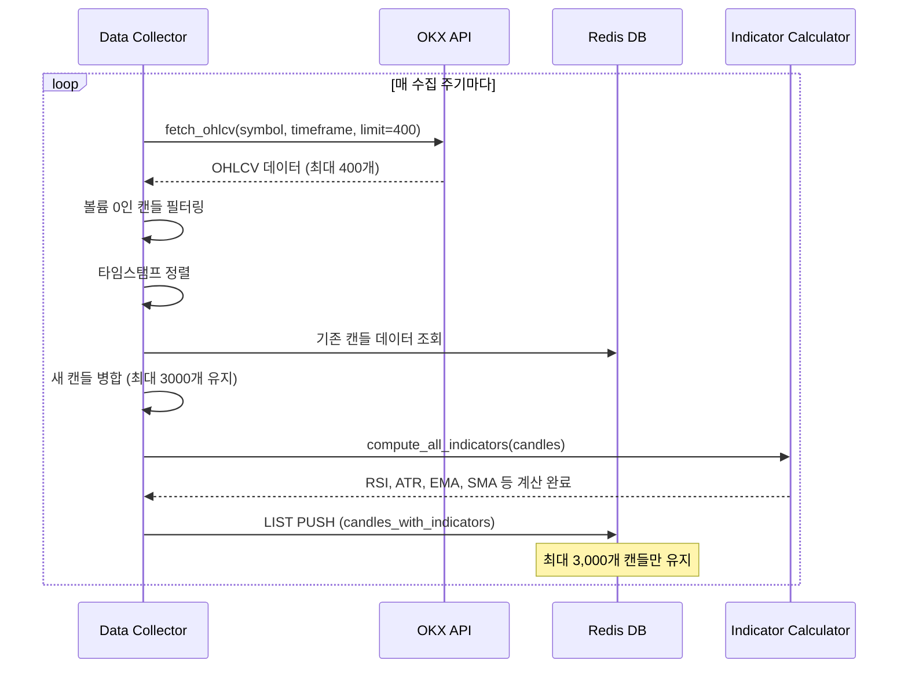
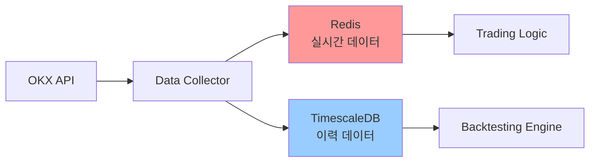

# BACKTEST_DATA_ANALYSIS.md

백테스팅 시스템 구축을 위한 데이터 소스 분석 리포트

---

## 📋 Executive Summary

HYPERRSI 트레이딩 전략은 **Redis 기반 실시간 데이터 저장소**와 **PostgreSQL/TimescaleDB 사용자 설정 저장소**를 사용하고 있습니다. 백테스팅을 위해 필요한 모든 캔들 및 지표 데이터는 Redis에 저장되어 있으며, TimescaleDB는 사용자 설정 관리 용도로만 사용됩니다.

**핵심 발견사항:**
- ✅ Redis에 최대 3,000개 캔들 저장 (시계열 데이터)
- ✅ 7개 타임프레임 지원: 1m, 3m, 5m, 15m, 30m, 1h, 4h
- ✅ 3개 심볼: BTC-USDT-SWAP, ETH-USDT-SWAP, SOL-USDT-SWAP
- ✅ RSI, ATR, EMA, SMA, Bollinger Bands 등 모든 지표 사전 계산됨
- ⚠️ TimescaleDB는 사용자 설정만 저장, 시계열 데이터 없음
- ⚠️ Redis 데이터 보존 기간: 약 2-48시간 (타임프레임에 따라 다름)

**백테스팅 데이터 접근 전략:**
- **단기 백테스팅 (2-48시간)**: Redis 직접 조회
- **장기 백테스팅 (7일-6개월)**: 별도 이력 DB 구축 필요 (TimescaleDB 또는 InfluxDB 권장)

---

## 1. Redis 데이터 구조 분석

### 1.1 캔들 데이터 키 패턴

HYPERRSI는 두 가지 형태로 캔들 데이터를 저장합니다:

#### A. 기본 캔들 데이터 (지표 없음)

**키 패턴:**
```
candles:{symbol}:{timeframe}
```

**예시:**
```
candles:BTC-USDT-SWAP:1m
candles:ETH-USDT-SWAP:1h
```

**데이터 형식:**
- **Redis 타입**: LIST (시계열 순서 보장)
- **각 항목 형식**: CSV 문자열
  ```
  timestamp,open,high,low,close,volume
  ```
- **예시 데이터:**
  ```
  1730367600,67234.5,67345.2,67180.0,67290.1,1234567.89
  ```

**참조 위치:**
- `HYPERRSI/src/data_collector/integrated_data_collector.py:284`
- `HYPERRSI/src/data_collector/integrated_data_collector.py:318-322`

---

#### B. 지표 포함 캔들 데이터 (백테스팅 핵심 데이터)

**키 패턴:**
```
candles_with_indicators:{symbol}:{timeframe}
```

**예시:**
```
candles_with_indicators:BTC-USDT-SWAP:1m
candles_with_indicators:ETH-USDT-SWAP:1h
candles_with_indicators:SOL-USDT-SWAP:15m
```

**데이터 형식:**
- **Redis 타입**: LIST (JSON 문자열 배열)
- **각 항목 형식**: JSON 객체
  ```json
  {
    "timestamp": 1730367600,
    "open": 67234.5,
    "high": 67345.2,
    "low": 67180.0,
    "close": 67290.1,
    "volume": 1234567.89,
    "rsi": 45.67,
    "atr": 123.45,
    "ema": 67250.3,
    "sma": 67240.8,
    "upper_band": 67500.0,
    "lower_band": 67000.0,
    "human_time": "2025-10-31 12:00:00",
    "human_time_kr": "2025-10-31 21:00:00"
  }
  ```

**저장 위치:**
- `HYPERRSI/src/data_collector/integrated_data_collector.py:360-401`
- `HYPERRSI/src/data_collector/integrated_data_collector.py:478-586`

**트레이딩 로직에서 사용:**
- `HYPERRSI/src/trading/execute_trading_logic.py:383` (캔들 데이터 조회)
- `HYPERRSI/src/trading/execute_trading_logic.py:449-453` (RSI 시그널 분석용)

---

### 1.2 데이터 수집 시스템

#### 폴링 기반 데이터 수집기

**주요 컴포넌트:**
- **파일**: `HYPERRSI/src/data_collector/integrated_data_collector.py`
- **수집 방식**: 폴링 (REST API)
- **데이터 소스**: OKX API (ccxt 라이브러리 사용)

**수집 주기:**

| 타임프레임 | 업데이트 간격 | 바 종료 시 폴링 |
|-----------|-------------|---------------|
| 1m        | 10초        | 5초 간격      |
| 3m        | 20초        | 5초 간격      |
| 5m        | 30초        | 5초 간격      |
| 15m       | 60초        | 5초 간격      |
| 30m       | 120초       | 5초 간격      |
| 1h        | 180초       | 5초 간격      |
| 4h        | 300초       | 5초 간격      |

**참조 위치:**
- `HYPERRSI/src/data_collector/integrated_data_collector.py:609-641` (폴링 워커)
- `shared/utils/time_helpers.py` (타임프레임별 업데이트 간격 계산)

---

#### 데이터 수집 프로세스



**참조 위치:**
- `HYPERRSI/src/data_collector/integrated_data_collector.py:77-171` (캔들 가져오기)
- `HYPERRSI/src/data_collector/integrated_data_collector.py:281-358` (캔들 업데이트)
- `HYPERRSI/src/data_collector/integrated_data_collector.py:360-401` (지표 저장)

---

### 1.3 계산된 지표 목록

백테스팅에 필요한 모든 지표는 `shared/indicators/` 모듈에서 계산됩니다.

**지표 계산 함수:**
- **위치**: `shared/indicators/_all_indicators.py`
- **함수**: `compute_all_indicators(candles, rsi_period=14, atr_period=14)`

**계산되는 지표:**

| 지표 카테고리 | 지표 이름 | 설명 |
|-------------|---------|------|
| **모멘텀** | RSI (Relative Strength Index) | 14 기간 RSI (과매수/과매도 판단) |
| **변동성** | ATR (Average True Range) | 14 기간 ATR (스톱로스 설정용) |
| **이동평균** | SMA (Simple Moving Average) | 단순 이동평균 |
| **이동평균** | EMA (Exponential Moving Average) | 지수 이동평균 |
| **이동평균** | RMA (Rolling Moving Average) | 롤링 이동평균 |
| **볼린저밴드** | Upper Band, Lower Band | 표준편차 기반 밴드 |
| **트렌드** | Trend State | 트렌드 상태 분석 (상승/하락/횡보) |

**참조 위치:**
- `shared/indicators/__init__.py:14` (메인 계산 함수 export)
- `shared/indicators/_all_indicators.py` (실제 계산 로직)
- `shared/indicators/_rsi.py` (RSI 계산)
- `shared/indicators/_atr.py` (ATR 계산)

---

### 1.4 데이터 저장 용량 및 보존 기간

#### 저장 용량 추정

**단일 심볼/타임프레임당:**
- **기본 캔들**: ~3,000개 × 60 bytes = ~180 KB
- **지표 포함 캔들**: ~3,000개 × 300 bytes = ~900 KB

**전체 데이터 (3 심볼 × 7 타임프레임):**
- **기본 캔들 총 크기**: 21 × 180 KB = ~3.8 MB
- **지표 포함 캔들 총 크기**: 21 × 900 KB = ~18.9 MB
- **총 예상 크기**: ~23 MB (메타데이터 포함 시 ~30 MB)

#### 데이터 보존 기간

| 타임프레임 | 최대 캔들 수 | 시간 범위 |
|-----------|------------|---------|
| 1m        | 3,000개    | ~50시간 (2.08일) |
| 3m        | 3,000개    | ~6.25일 |
| 5m        | 3,000개    | ~10.4일 |
| 15m       | 3,000개    | ~31.25일 |
| 30m       | 3,000개    | ~62.5일 |
| 1h        | 3,000개    | ~125일 (4개월) |
| 4h        | 3,000개    | ~500일 (16개월) |

**참조 위치:**
- `HYPERRSI/src/data_collector/integrated_data_collector.py:28` (`MAX_CANDLE_LEN = 3000`)
- `HYPERRSI/src/data_collector/integrated_data_collector.py:312-313` (최대 길이 제한)

---

## 2. TimescaleDB/PostgreSQL 스키마 분석

### 2.1 스키마 개요

**중요 발견:** TimescaleDB는 **시계열 캔들 데이터를 저장하지 않습니다**. 오직 사용자 설정만 저장합니다.

**마이그레이션 파일:**
- `HYPERRSI/migrations/001_create_user_settings_tables.sql`

### 2.2 user_settings 테이블 (사용자 설정)

**테이블 구조:**

```sql
CREATE TABLE IF NOT EXISTS user_settings (
    id UUID PRIMARY KEY DEFAULT gen_random_uuid(),
    user_id UUID NOT NULL,
    okx_uid TEXT NOT NULL,
    telegram_id TEXT,

    setting_type TEXT NOT NULL,  -- 'preferences', 'params', 'dual_side'
    settings JSONB NOT NULL DEFAULT '{}',

    version INTEGER NOT NULL DEFAULT 1,
    is_active BOOLEAN NOT NULL DEFAULT TRUE,

    created_at TIMESTAMPTZ NOT NULL DEFAULT NOW(),
    updated_at TIMESTAMPTZ NOT NULL DEFAULT NOW(),
    deleted_at TIMESTAMPTZ
);
```

**저장되는 설정 유형:**

1. **preferences** (기본 환경설정)
   - `symbol`: 거래 심볼
   - `timeframe`: 타임프레임
   - `leverage`: 레버리지
   - `investment`: 투자금액

2. **params** (전략 파라미터)
   - `rsi_oversold`: RSI 과매도 기준 (기본값: 30)
   - `rsi_overbought`: RSI 과매수 기준 (기본값: 70)
   - `entry_option`: 진입 옵션 (역추세/순추세)
   - `trend_timeframe`: 트렌드 분석 타임프레임

3. **dual_side** (양방향 거래 설정)
   - 롱/숏 포지션 관리 설정

**참조 위치:**
- `HYPERRSI/migrations/001_create_user_settings_tables.sql:14-40`
- `shared/constants/default_settings.py` (기본값 정의)

---

## 3. 백테스팅에 필요한 데이터 요구사항

### 3.1 트레이딩 로직 데이터 요구사항

**핵심 파일:** `HYPERRSI/src/trading/execute_trading_logic.py`

#### 필수 입력 데이터

1. **캔들 데이터 (최소 14개 이상)**
   ```python
   # execute_trading_logic.py:452
   raw_data_list = await redis.lrange(redis_key, -14, -1)
   ```
   - RSI 계산을 위해 최소 14개 캔들 필요
   - 권장: 30개 이상 (이동평균 계산 안정성)

2. **RSI 값 배열**
   ```python
   # execute_trading_logic.py:475-479
   for raw_data in raw_data_list:
       candle_data = json.loads(raw_data)
       if 'rsi' in candle_data and candle_data['rsi'] is not None:
           rsi_values.append(candle_data['rsi'])
   ```

3. **트렌드 상태**
   ```python
   # execute_trading_logic.py:500
   analysis = await calculator.analyze_market_state_from_redis(
       symbol, str(timeframe), trend_timeframe_str
   )
   current_state = analysis['extreme_state']
   ```

#### 사용자 설정 파라미터

```python
# execute_trading_logic.py:491-497
rsi_signals = await trading_service.check_rsi_signals(
    rsi_values,
    {
        'entry_option': user_settings['entry_option'],
        'rsi_oversold': user_settings['rsi_oversold'],
        'rsi_overbought': user_settings['rsi_overbought']
    }
)
```

**필수 설정 값:**
- `entry_option`: 진입 옵션 (역추세/순추세)
- `rsi_oversold`: RSI 과매도 기준 (기본값: 30)
- `rsi_overbought`: RSI 과매수 기준 (기본값: 70)
- `leverage`: 레버리지 (기본값: 10)
- `investment`: 투자금액 (심볼별)
- `trend_timeframe`: 트렌드 분석용 타임프레임

**참조 위치:**
- `HYPERRSI/src/trading/execute_trading_logic.py:178` (사용자 설정 로드)
- `shared/constants/default_settings.py` (기본값)

---

### 3.2 백테스팅 최소 데이터 기간

**시나리오별 요구사항:**

| 백테스팅 목적 | 최소 기간 | 권장 기간 | 데이터 소스 |
|-------------|---------|---------|-----------|
| 전략 검증 (단기) | 7일 | 30일 | Redis (1h 이하) 또는 별도 DB |
| 파라미터 최적화 | 30일 | 90일 | 별도 이력 DB 필요 |
| 장기 성과 분석 | 90일 | 180일 | 별도 이력 DB 필요 |
| 시장 사이클 분석 | 180일 | 1년 | 별도 이력 DB 필요 |

**RSI 계산 요구사항:**
- **최소 캔들 수**: 14개 (RSI 기본 기간)
- **안정적 계산**: 30개 이상 권장
- **트렌드 분석**: 100개 이상 권장 (장기 트렌드 파악)

**참조 위치:**
- `HYPERRSI/src/trading/execute_trading_logic.py:481` (최소 2개 RSI 값 요구)
- `shared/indicators/_rsi.py` (14 기간 RSI 계산)

---

## 4. 데이터 가용성 평가

### 4.1 현재 시스템의 한계

#### Redis 기반 저장소의 제약사항

| 제약사항 | 영향 | 해결방안 |
|---------|------|---------|
| **최대 3,000개 캔들만 보관** | 1분봉 기준 ~50시간 이력만 보존 | 별도 이력 DB 구축 |
| **휘발성 메모리** | 서버 재시작 시 데이터 손실 가능 | Redis persistence 활성화 또는 DB 백업 |
| **백업 없음** | 과거 데이터 복구 불가능 | 주기적 DB 백업 시스템 구축 |

#### 백테스팅을 위한 데이터 부족

| 타임프레임 | 현재 보존 기간 | 백테스팅 권장 기간 | 갭 |
|-----------|--------------|-----------------|-----|
| 1m        | ~2일         | 30일            | 28일 부족 |
| 15m       | ~31일        | 90일            | 59일 부족 |
| 1h        | ~125일       | 180일           | 55일 부족 |
| 4h        | ~500일       | 365일           | ✅ 충분 |

---

### 4.2 백테스팅 데이터 접근 전략

#### 전략 1: Redis 직접 조회 (단기 백테스팅)

**적용 범위:**
- 1시간봉: 최대 4개월
- 4시간봉: 최대 16개월

**장점:**
- 구현 간단 (기존 Redis 인프라 활용)
- 실시간 데이터와 동일한 형식
- 별도 DB 구축 불필요

**단점:**
- 장기 백테스팅 불가능
- 서버 재시작 시 데이터 손실 위험

**구현 예시:**
```python
async def load_backtest_data_from_redis(
    symbol: str,
    timeframe: str,
    start_date: datetime,
    end_date: datetime
) -> List[Dict]:
    key = f"candles_with_indicators:{symbol}:{timeframe}"
    all_candles = await redis.lrange(key, 0, -1)

    # 날짜 범위 필터링
    filtered_candles = []
    for candle_json in all_candles:
        candle = json.loads(candle_json)
        candle_time = datetime.fromtimestamp(candle['timestamp'])
        if start_date <= candle_time <= end_date:
            filtered_candles.append(candle)

    return filtered_candles
```

---

#### 전략 2: 이력 데이터베이스 구축 (장기 백테스팅)

**권장 솔루션:** TimescaleDB 또는 InfluxDB

**아키텍처:**



**TimescaleDB 스키마 제안:**

```sql
-- Hypertable for candle data
CREATE TABLE candles_history (
    timestamp TIMESTAMPTZ NOT NULL,
    symbol TEXT NOT NULL,
    timeframe TEXT NOT NULL,

    open DOUBLE PRECISION NOT NULL,
    high DOUBLE PRECISION NOT NULL,
    low DOUBLE PRECISION NOT NULL,
    close DOUBLE PRECISION NOT NULL,
    volume DOUBLE PRECISION NOT NULL,

    -- 지표
    rsi DOUBLE PRECISION,
    atr DOUBLE PRECISION,
    ema DOUBLE PRECISION,
    sma DOUBLE PRECISION,
    upper_band DOUBLE PRECISION,
    lower_band DOUBLE PRECISION,

    PRIMARY KEY (symbol, timeframe, timestamp)
);

-- TimescaleDB 하이퍼테이블 생성
SELECT create_hypertable('candles_history', 'timestamp');

-- 압축 정책 (1주일 이상 된 데이터)
ALTER TABLE candles_history SET (
    timescaledb.compress,
    timescaledb.compress_segmentby = 'symbol, timeframe'
);

SELECT add_compression_policy('candles_history', INTERVAL '7 days');

-- 인덱스
CREATE INDEX idx_candles_symbol_timeframe
    ON candles_history (symbol, timeframe, timestamp DESC);
```

**데이터 수집 프로세스 개선:**

```python
# HYPERRSI/src/data_collector/integrated_data_collector.py 수정

async def save_candles_to_history_db(
    symbol: str,
    timeframe: str,
    candles_with_ind: List[Dict]
):
    """TimescaleDB에 캔들 데이터 저장"""
    async with get_db() as db:
        for candle in candles_with_ind:
            await db.execute(
                """
                INSERT INTO candles_history (
                    timestamp, symbol, timeframe,
                    open, high, low, close, volume,
                    rsi, atr, ema, sma, upper_band, lower_band
                )
                VALUES ($1, $2, $3, $4, $5, $6, $7, $8, $9, $10, $11, $12, $13, $14)
                ON CONFLICT (symbol, timeframe, timestamp)
                DO UPDATE SET
                    open = EXCLUDED.open,
                    high = EXCLUDED.high,
                    low = EXCLUDED.low,
                    close = EXCLUDED.close,
                    volume = EXCLUDED.volume,
                    rsi = EXCLUDED.rsi,
                    atr = EXCLUDED.atr,
                    ema = EXCLUDED.ema,
                    sma = EXCLUDED.sma,
                    upper_band = EXCLUDED.upper_band,
                    lower_band = EXCLUDED.lower_band
                """,
                datetime.fromtimestamp(candle['timestamp']),
                symbol,
                timeframe,
                candle['open'],
                candle['high'],
                candle['low'],
                candle['close'],
                candle['volume'],
                candle.get('rsi'),
                candle.get('atr'),
                candle.get('ema'),
                candle.get('sma'),
                candle.get('upper_band'),
                candle.get('lower_band')
            )
```

---

#### 전략 3: 하이브리드 접근 (최적 성능)

**개념:**
- **단기 데이터 (최근 48시간)**: Redis에서 조회
- **장기 데이터 (48시간 이상)**: TimescaleDB에서 조회

**장점:**
- Redis의 빠른 성능 활용
- 장기 백테스팅 지원
- 메모리 사용 최적화

**구현 예시:**

```python
async def load_backtest_data_hybrid(
    symbol: str,
    timeframe: str,
    start_date: datetime,
    end_date: datetime
) -> List[Dict]:
    cutoff_time = datetime.now() - timedelta(hours=48)

    candles = []

    # 오래된 데이터: TimescaleDB 조회
    if start_date < cutoff_time:
        db_end = min(cutoff_time, end_date)
        historical_data = await fetch_from_timescaledb(
            symbol, timeframe, start_date, db_end
        )
        candles.extend(historical_data)

    # 최근 데이터: Redis 조회
    if end_date > cutoff_time:
        redis_start = max(cutoff_time, start_date)
        recent_data = await fetch_from_redis(
            symbol, timeframe, redis_start, end_date
        )
        candles.extend(recent_data)

    return sorted(candles, key=lambda x: x['timestamp'])
```

---

## 5. 권장사항 및 구현 로드맵

### 5.1 단계별 백테스팅 시스템 구축 로드맵

#### Phase 1: 단기 백테스팅 (Redis 기반)

**목표:** 최근 2-4일 데이터로 전략 검증

**구현 작업:**
1. Redis 데이터 조회 API 개발
2. 백테스팅 엔진 프로토타입 (시뮬레이션 모드)
3. 성과 지표 계산 (수익률, 승률, MDD)

**예상 소요 시간:** 1주일

---

#### Phase 2: 이력 DB 구축 (TimescaleDB)

**목표:** 6개월 이상 데이터 보존

**구현 작업:**
1. TimescaleDB 스키마 설계 및 마이그레이션
2. Data Collector 개선 (Redis + DB 동시 저장)
3. 백필 스크립트 (OKX API에서 과거 데이터 수집)
4. 백업 및 복구 시스템

**예상 소요 시간:** 2주일

---

#### Phase 3: 백테스팅 마이크로서비스

**목표:** 독립 백테스팅 서비스 구축

**구현 작업:**
1. FastAPI 기반 백테스팅 API 서버
2. 트레이딩 로직 공유 라이브러리 추출
3. 파라미터 최적화 기능
4. 리포팅 및 시각화

**예상 소요 시간:** 3주일

---

### 5.2 즉시 실행 가능한 작업

#### 1. Redis 데이터 보존 강화

**현재 문제:** Redis 재시작 시 데이터 손실

**해결책:**
```bash
# redis.conf 수정
save 900 1      # 900초(15분)마다 최소 1개 변경 시 저장
save 300 10     # 300초(5분)마다 최소 10개 변경 시 저장
save 60 10000   # 60초마다 최소 10,000개 변경 시 저장

appendonly yes  # AOF (Append-Only File) 활성화
appendfsync everysec  # 1초마다 fsync
```

---

#### 2. 데이터 무결성 검증 스크립트

**목적:** Redis 데이터 완정성 확인

```python
# scripts/validate_redis_data.py
async def validate_candle_data():
    for symbol in ["BTC-USDT-SWAP", "ETH-USDT-SWAP", "SOL-USDT-SWAP"]:
        for tf in ["1m", "5m", "15m", "1h"]:
            key = f"candles_with_indicators:{symbol}:{tf}"
            candles = await redis.lrange(key, 0, -1)

            # 갭 체크
            gaps = check_timestamp_gaps(candles, tf)
            if gaps:
                logger.warning(f"데이터 갭 발견: {key} - {len(gaps)}개")

            # 지표 null 체크
            null_indicators = check_null_indicators(candles)
            if null_indicators:
                logger.warning(f"Null 지표 발견: {key} - {null_indicators}")
```

---

#### 3. 백필 스크립트 (과거 데이터 수집)

**목적:** OKX API에서 과거 6개월 데이터 수집

```python
# scripts/backfill_historical_data.py
async def backfill_data(
    symbol: str,
    timeframe: str,
    start_date: datetime,
    end_date: datetime
):
    """OKX API에서 과거 데이터를 수집하여 DB에 저장"""

    # OKX API는 한 번에 최대 300개 캔들 제공
    batch_size = 300
    current_date = start_date

    while current_date < end_date:
        candles = await exchange.fetch_ohlcv(
            symbol,
            timeframe,
            since=int(current_date.timestamp() * 1000),
            limit=batch_size
        )

        # 지표 계산
        candles_with_ind = compute_all_indicators(candles)

        # TimescaleDB에 저장
        await save_to_timescaledb(symbol, timeframe, candles_with_ind)

        # 다음 배치로 이동
        current_date = datetime.fromtimestamp(candles[-1]['timestamp'])
        await asyncio.sleep(0.2)  # Rate limit 고려
```

---

## 6. 결론 및 다음 단계

### 6.1 핵심 발견사항 요약

✅ **백테스팅 가능 여부:** 가능 (단, 별도 이력 DB 구축 필요)

✅ **데이터 접근성:**
- Redis: 실시간 데이터, 최대 3,000개 캔들
- TimescaleDB: 사용자 설정만 보관 (시계열 데이터 없음)

⚠️ **제약사항:**
- 1분봉 기준 ~2일 이력만 Redis에 보관
- 장기 백테스팅 (30일 이상)을 위해서는 별도 DB 필요

✅ **필요 지표:** 모두 사전 계산됨 (RSI, ATR, EMA, SMA 등)

---

### 6.2 다음 단계

다음 문서를 작성해주세요:

1. **BACKTEST_ARCHITECTURE.md**
   - 마이크로서비스 아키텍처 설계
   - 데이터 접근 계층 설계
   - API 인터페이스 명세
   - 공유 라이브러리 추출 전략

2. **BACKTEST_ENGINE_DESIGN.md**
   - 백테스팅 엔진 컴포넌트 설계
   - 시뮬레이션 모드 구현 방안
   - 성과 분석 알고리즘
   - 리포팅 시스템

3. **BACKTEST_IMPLEMENTATION_ROADMAP.md**
   - 단계별 구현 계획
   - 우선순위 및 일정
   - 리스크 관리
   - 배포 전략

---

## 부록 A: 주요 파일 참조

| 파일 경로 | 설명 |
|----------|------|
| `HYPERRSI/src/data_collector/integrated_data_collector.py` | 폴링 기반 데이터 수집기 |
| `HYPERRSI/src/trading/execute_trading_logic.py` | 트레이딩 로직 (RSI + 트렌드) |
| `shared/indicators/_all_indicators.py` | 지표 계산 함수 |
| `shared/constants/redis_pattern.py` | Redis 키 패턴 정의 |
| `HYPERRSI/migrations/001_create_user_settings_tables.sql` | 사용자 설정 테이블 스키마 |

---

## 부록 B: Redis 키 전체 목록

```
# 캔들 데이터
candles:{symbol}:{timeframe}
candles_with_indicators:{symbol}:{timeframe}

# 현재 진행 중인 캔들
current_candle:{symbol}:{timeframe}
current_candle_with_indicators:{symbol}:{timeframe}

# 최신 캔들
latest:{symbol}:{timeframe}
latest_with_indicators:{symbol}:{timeframe}

# 사용자 관련
user:{user_id}:trading:status
user:{user_id}:settings
user:{user_id}:preferences
user:{user_id}:position:{symbol}:{side}

# 기타
candle_data_alert_sent:{user_id}:{symbol}:{timeframe}
```

---

**작성일:** 2025-10-31
**작성자:** Claude Code Agent
**버전:** 1.0
