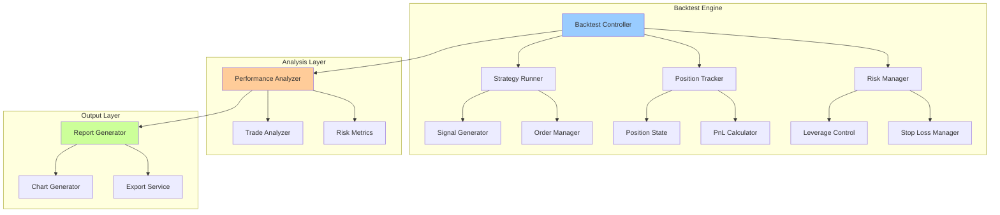
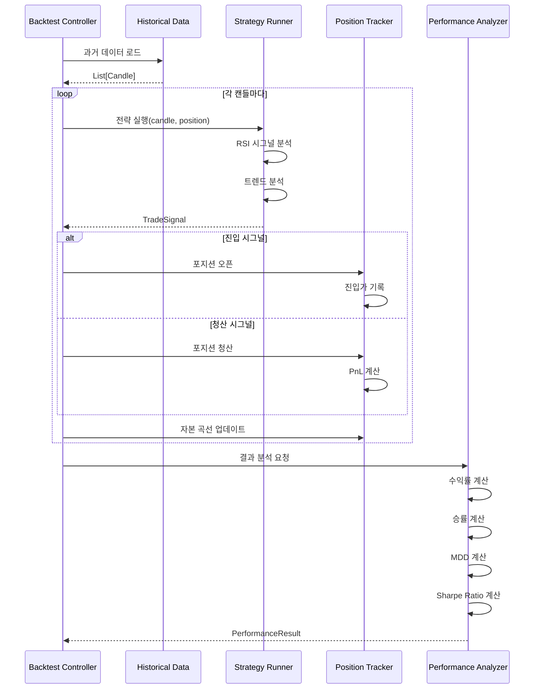
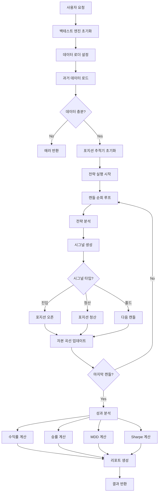

# BACKTEST_ENGINE_DESIGN.md

백테스팅 엔진 상세 설계 문서

---

## 📋 Executive Summary

이 문서는 백테스팅 엔진의 **핵심 컴포넌트**, **알고리즘**, **성과 분석 로직**을 상세히 정의합니다. HYPERRSI 전략을 시뮬레이션 모드로 실행하고, 다양한 성과 지표를 계산하며, 파라미터 최적화 및 리포팅 기능을 제공합니다.

**핵심 컴포넌트:**
- ✅ **Strategy Runner**: 전략 실행 및 시그널 생성
- ✅ **Position Tracker**: 가상 포지션 관리 (진입/청산/손익)
- ✅ **Performance Analyzer**: 성과 지표 계산 (Sharpe, MDD, Win Rate)
- ✅ **Parameter Optimizer**: Grid Search, Genetic Algorithm
- ✅ **Report Generator**: HTML/PDF 리포트, 차트 생성

---

## 1. 백테스팅 엔진 아키텍처

### 1.1 컴포넌트 구조



---

### 1.2 데이터 흐름



---

## 2. 핵심 컴포넌트 상세 설계

### 2.1 Strategy Runner (전략 실행기)

**역할:** 트레이딩 전략을 시뮬레이션 모드로 실행하여 시그널 생성

```python
# app/core/strategy_runner.py

from typing import List, Dict, Optional
from datetime import datetime
from trading_core.strategy.hyperrsi import HYPERRSIStrategy
from trading_core.strategy.base import Candle, Position, TradeSignal
from .position_tracker import PositionTracker

class StrategyRunner:
    """
    전략 실행기

    백테스팅 환경에서 전략을 실행하고 시그널 생성
    """

    def __init__(
        self,
        strategy: HYPERRSIStrategy,
        position_tracker: PositionTracker
    ):
        self.strategy = strategy
        self.position_tracker = position_tracker
        self.signal_history: List[Dict] = []

    def run_step(
        self,
        candles: List[Candle],
        current_candle: Candle,
        user_settings: Dict
    ) -> TradeSignal:
        """
        단일 스텝 실행

        Args:
            candles: 과거 캔들 데이터 (최소 14개)
            current_candle: 현재 캔들
            user_settings: 사용자 전략 설정

        Returns:
            TradeSignal: 거래 시그널
        """
        # 현재 포지션 조회
        current_position = self.position_tracker.get_current_position()

        # 전략 분석
        signal = self.strategy.analyze(
            candles,
            current_position,
            user_settings
        )

        # 시그널 히스토리 기록
        self.signal_history.append({
            'timestamp': current_candle.timestamp,
            'signal': signal.action,
            'reason': signal.reason,
            'rsi': current_candle.rsi,
            'price': current_candle.close
        })

        return signal

    def get_signal_history(self) -> List[Dict]:
        """시그널 히스토리 조회"""
        return self.signal_history

    def reset(self):
        """전략 상태 초기화"""
        self.signal_history = []
```

---

### 2.2 Position Tracker (포지션 추적기)

**역할:** 가상 포지션 관리, 진입/청산 추적, PnL 계산

```python
# app/core/position_tracker.py

from typing import List, Dict, Optional
from datetime import datetime
from pydantic import BaseModel
from enum import Enum

class PositionSide(str, Enum):
    LONG = "long"
    SHORT = "short"

class PositionState(str, Enum):
    OPEN = "open"
    CLOSED = "closed"

class Position(BaseModel):
    """포지션 모델"""
    id: str
    side: PositionSide
    entry_price: float
    entry_time: int
    exit_price: Optional[float] = None
    exit_time: Optional[int] = None
    contracts: float
    leverage: float
    state: PositionState = PositionState.OPEN

    # 손익
    realized_pnl: float = 0.0
    unrealized_pnl: float = 0.0

    # 수수료
    entry_fee: float = 0.0
    exit_fee: float = 0.0

    # 메타데이터
    entry_reason: str = ""
    exit_reason: str = ""

class PositionTracker:
    """
    포지션 추적기

    백테스팅 중 가상 포지션을 관리하고 PnL 계산
    """

    def __init__(self, fee_rate: float = 0.0005):
        """
        Args:
            fee_rate: 거래 수수료율 (기본값: 0.05%)
        """
        self.current_position: Optional[Position] = None
        self.position_history: List[Position] = []
        self.fee_rate = fee_rate

    def open_position(
        self,
        side: PositionSide,
        entry_price: float,
        entry_time: int,
        contracts: float,
        leverage: float,
        reason: str = ""
    ) -> Position:
        """
        포지션 진입

        Args:
            side: long or short
            entry_price: 진입가
            entry_time: 진입 시각 (Unix timestamp)
            contracts: 계약 수량
            leverage: 레버리지
            reason: 진입 이유

        Returns:
            Position: 생성된 포지션
        """
        if self.current_position:
            raise ValueError("이미 열린 포지션이 있습니다")

        # 진입 수수료 계산
        entry_fee = entry_price * contracts * self.fee_rate

        position = Position(
            id=f"pos_{entry_time}",
            side=side,
            entry_price=entry_price,
            entry_time=entry_time,
            contracts=contracts,
            leverage=leverage,
            entry_fee=entry_fee,
            entry_reason=reason
        )

        self.current_position = position
        return position

    def close_position(
        self,
        exit_price: float,
        exit_time: int,
        reason: str = ""
    ) -> Position:
        """
        포지션 청산

        Args:
            exit_price: 청산가
            exit_time: 청산 시각
            reason: 청산 이유

        Returns:
            Position: 청산된 포지션
        """
        if not self.current_position:
            raise ValueError("열린 포지션이 없습니다")

        position = self.current_position

        # 청산 수수료 계산
        exit_fee = exit_price * position.contracts * self.fee_rate

        # PnL 계산
        if position.side == PositionSide.LONG:
            pnl = (exit_price - position.entry_price) * position.contracts
        else:  # SHORT
            pnl = (position.entry_price - exit_price) * position.contracts

        # 수수료 차감
        realized_pnl = pnl - position.entry_fee - exit_fee

        # 포지션 업데이트
        position.exit_price = exit_price
        position.exit_time = exit_time
        position.exit_fee = exit_fee
        position.realized_pnl = realized_pnl
        position.state = PositionState.CLOSED
        position.exit_reason = reason

        # 히스토리에 추가
        self.position_history.append(position)

        # 현재 포지션 초기화
        self.current_position = None

        return position

    def update_unrealized_pnl(self, current_price: float):
        """
        미실현 손익 업데이트

        Args:
            current_price: 현재 가격
        """
        if not self.current_position:
            return

        position = self.current_position

        if position.side == PositionSide.LONG:
            pnl = (current_price - position.entry_price) * position.contracts
        else:  # SHORT
            pnl = (position.entry_price - current_price) * position.contracts

        # 수수료 고려
        position.unrealized_pnl = pnl - position.entry_fee

    def get_current_position(self) -> Optional[Position]:
        """현재 포지션 조회"""
        return self.current_position

    def get_position_history(self) -> List[Position]:
        """포지션 히스토리 조회"""
        return self.position_history

    def get_total_realized_pnl(self) -> float:
        """총 실현 손익 계산"""
        return sum(p.realized_pnl for p in self.position_history)

    def reset(self):
        """추적기 초기화"""
        self.current_position = None
        self.position_history = []
```

---

### 2.3 Performance Analyzer (성과 분석기)

**역할:** 백테스팅 결과를 분석하여 성과 지표 계산

```python
# app/services/performance.py

from typing import List, Dict
import numpy as np
from pydantic import BaseModel
from app.core.position_tracker import Position

class PerformanceMetrics(BaseModel):
    """성과 지표"""
    # 수익성
    total_return: float  # 총 수익률 (%)
    annual_return: float  # 연환산 수익률 (%)
    total_pnl: float  # 총 손익 (USDT)

    # 승률
    win_rate: float  # 승률 (%)
    total_trades: int  # 총 거래 횟수
    winning_trades: int  # 승리 거래
    losing_trades: int  # 패배 거래

    # 평균 손익
    avg_win: float  # 평균 승리 금액
    avg_loss: float  # 평균 손실 금액
    largest_win: float  # 최대 승리
    largest_loss: float  # 최대 손실

    # 리스크
    max_drawdown: float  # 최대 낙폭 (%)
    max_drawdown_duration: int  # 최대 낙폭 기간 (일)

    # 위험 조정 수익률
    sharpe_ratio: float  # 샤프 지수
    sortino_ratio: float  # 소르티노 지수
    calmar_ratio: float  # 칼마 지수

    # 거래 통계
    avg_trade_duration: float  # 평균 거래 기간 (시간)
    profit_factor: float  # 수익 팩터
    expectancy: float  # 기대값

class PerformanceAnalyzer:
    """
    성과 분석기

    백테스팅 결과를 분석하여 다양한 성과 지표 계산
    """

    def __init__(self):
        pass

    def analyze(
        self,
        equity_curve: List[Dict],
        positions: List[Position],
        initial_capital: float,
        backtest_days: int
    ) -> PerformanceMetrics:
        """
        성과 분석 실행

        Args:
            equity_curve: 자본 곡선 [{timestamp, equity}, ...]
            positions: 포지션 히스토리
            initial_capital: 초기 자본
            backtest_days: 백테스팅 기간 (일)

        Returns:
            PerformanceMetrics: 성과 지표
        """
        # 기본 통계
        total_trades = len(positions)
        if total_trades == 0:
            return self._empty_metrics()

        winning_positions = [p for p in positions if p.realized_pnl > 0]
        losing_positions = [p for p in positions if p.realized_pnl <= 0]

        winning_trades = len(winning_positions)
        losing_trades = len(losing_positions)

        # 수익성
        total_pnl = sum(p.realized_pnl for p in positions)
        final_equity = equity_curve[-1]['equity'] if equity_curve else initial_capital
        total_return = ((final_equity - initial_capital) / initial_capital) * 100

        # 연환산 수익률
        years = backtest_days / 365.0
        annual_return = ((1 + total_return / 100) ** (1 / years) - 1) * 100 if years > 0 else 0

        # 승률
        win_rate = (winning_trades / total_trades) * 100 if total_trades > 0 else 0

        # 평균 손익
        avg_win = np.mean([p.realized_pnl for p in winning_positions]) if winning_positions else 0
        avg_loss = np.mean([p.realized_pnl for p in losing_positions]) if losing_positions else 0
        largest_win = max([p.realized_pnl for p in positions], default=0)
        largest_loss = min([p.realized_pnl for p in positions], default=0)

        # 최대 낙폭
        max_dd, max_dd_duration = self._calculate_max_drawdown(equity_curve)

        # 샤프 지수
        sharpe_ratio = self._calculate_sharpe_ratio(equity_curve)

        # 소르티노 지수
        sortino_ratio = self._calculate_sortino_ratio(equity_curve)

        # 칼마 지수
        calmar_ratio = annual_return / max_dd if max_dd > 0 else 0

        # 평균 거래 기간
        avg_duration = self._calculate_avg_trade_duration(positions)

        # 수익 팩터
        total_wins = sum(p.realized_pnl for p in winning_positions)
        total_losses = abs(sum(p.realized_pnl for p in losing_positions))
        profit_factor = total_wins / total_losses if total_losses > 0 else 0

        # 기대값
        expectancy = (win_rate / 100 * avg_win) - ((100 - win_rate) / 100 * abs(avg_loss))

        return PerformanceMetrics(
            total_return=round(total_return, 2),
            annual_return=round(annual_return, 2),
            total_pnl=round(total_pnl, 2),
            win_rate=round(win_rate, 2),
            total_trades=total_trades,
            winning_trades=winning_trades,
            losing_trades=losing_trades,
            avg_win=round(avg_win, 2),
            avg_loss=round(avg_loss, 2),
            largest_win=round(largest_win, 2),
            largest_loss=round(largest_loss, 2),
            max_drawdown=round(max_dd, 2),
            max_drawdown_duration=max_dd_duration,
            sharpe_ratio=round(sharpe_ratio, 2),
            sortino_ratio=round(sortino_ratio, 2),
            calmar_ratio=round(calmar_ratio, 2),
            avg_trade_duration=round(avg_duration, 2),
            profit_factor=round(profit_factor, 2),
            expectancy=round(expectancy, 2)
        )

    def _calculate_max_drawdown(
        self,
        equity_curve: List[Dict]
    ) -> tuple[float, int]:
        """
        최대 낙폭(MDD) 및 기간 계산

        Returns:
            (max_drawdown_pct, duration_days)
        """
        if not equity_curve:
            return 0.0, 0

        peak = equity_curve[0]['equity']
        max_dd = 0.0
        max_dd_duration = 0
        current_dd_duration = 0
        peak_timestamp = equity_curve[0]['timestamp']

        for point in equity_curve:
            equity = point['equity']
            timestamp = point['timestamp']

            if equity > peak:
                peak = equity
                peak_timestamp = timestamp
                current_dd_duration = 0
            else:
                dd = ((peak - equity) / peak) * 100
                if dd > max_dd:
                    max_dd = dd

                # 기간 계산 (일 단위)
                current_dd_duration = (timestamp - peak_timestamp) / 86400
                if current_dd_duration > max_dd_duration:
                    max_dd_duration = int(current_dd_duration)

        return max_dd, max_dd_duration

    def _calculate_sharpe_ratio(
        self,
        equity_curve: List[Dict],
        risk_free_rate: float = 0.02
    ) -> float:
        """
        샤프 지수 계산

        Args:
            equity_curve: 자본 곡선
            risk_free_rate: 무위험 수익률 (연 2%)

        Returns:
            float: 샤프 지수
        """
        if len(equity_curve) < 2:
            return 0.0

        # 일별 수익률 계산
        returns = []
        for i in range(1, len(equity_curve)):
            prev_equity = equity_curve[i-1]['equity']
            curr_equity = equity_curve[i]['equity']
            ret = (curr_equity - prev_equity) / prev_equity
            returns.append(ret)

        if not returns:
            return 0.0

        # 평균 수익률
        mean_return = np.mean(returns)

        # 표준편차
        std_dev = np.std(returns)

        if std_dev == 0:
            return 0.0

        # 일별 무위험 수익률
        daily_risk_free = risk_free_rate / 365

        # 샤프 지수 (연환산)
        sharpe = ((mean_return - daily_risk_free) / std_dev) * np.sqrt(365)

        return sharpe

    def _calculate_sortino_ratio(
        self,
        equity_curve: List[Dict],
        risk_free_rate: float = 0.02
    ) -> float:
        """
        소르티노 지수 계산 (하방 리스크만 고려)

        Returns:
            float: 소르티노 지수
        """
        if len(equity_curve) < 2:
            return 0.0

        # 일별 수익률 계산
        returns = []
        for i in range(1, len(equity_curve)):
            prev_equity = equity_curve[i-1]['equity']
            curr_equity = equity_curve[i]['equity']
            ret = (curr_equity - prev_equity) / prev_equity
            returns.append(ret)

        if not returns:
            return 0.0

        # 평균 수익률
        mean_return = np.mean(returns)

        # 하방 편차 (음수 수익률만)
        downside_returns = [r for r in returns if r < 0]
        if not downside_returns:
            return 0.0

        downside_std = np.std(downside_returns)

        if downside_std == 0:
            return 0.0

        # 일별 무위험 수익률
        daily_risk_free = risk_free_rate / 365

        # 소르티노 지수 (연환산)
        sortino = ((mean_return - daily_risk_free) / downside_std) * np.sqrt(365)

        return sortino

    def _calculate_avg_trade_duration(
        self,
        positions: List[Position]
    ) -> float:
        """
        평균 거래 기간 계산 (시간 단위)

        Returns:
            float: 평균 거래 기간
        """
        if not positions:
            return 0.0

        durations = []
        for pos in positions:
            if pos.exit_time:
                duration_seconds = pos.exit_time - pos.entry_time
                duration_hours = duration_seconds / 3600
                durations.append(duration_hours)

        return np.mean(durations) if durations else 0.0

    def _empty_metrics(self) -> PerformanceMetrics:
        """빈 메트릭 반환 (거래 없음)"""
        return PerformanceMetrics(
            total_return=0.0,
            annual_return=0.0,
            total_pnl=0.0,
            win_rate=0.0,
            total_trades=0,
            winning_trades=0,
            losing_trades=0,
            avg_win=0.0,
            avg_loss=0.0,
            largest_win=0.0,
            largest_loss=0.0,
            max_drawdown=0.0,
            max_drawdown_duration=0,
            sharpe_ratio=0.0,
            sortino_ratio=0.0,
            calmar_ratio=0.0,
            avg_trade_duration=0.0,
            profit_factor=0.0,
            expectancy=0.0
        )
```

---

### 2.4 Risk Manager (리스크 관리자)

**역할:** 레버리지 제한, 스톱로스 관리, 포지션 크기 조절

```python
# app/core/risk_manager.py

from typing import Dict, Optional
from pydantic import BaseModel

class RiskLimits(BaseModel):
    """리스크 제한"""
    max_leverage: float = 125.0
    max_position_size_pct: float = 100.0  # 자본 대비 %
    stop_loss_pct: float = 5.0  # 손실 제한 %
    daily_loss_limit_pct: float = 10.0  # 일일 손실 제한

class RiskManager:
    """
    리스크 관리자

    레버리지, 포지션 크기, 스톱로스 관리
    """

    def __init__(self, limits: RiskLimits):
        self.limits = limits

    def validate_leverage(self, leverage: float) -> bool:
        """레버리지 검증"""
        return 1.0 <= leverage <= self.limits.max_leverage

    def calculate_position_size(
        self,
        capital: float,
        leverage: float,
        price: float,
        risk_pct: float = 1.0
    ) -> float:
        """
        포지션 크기 계산

        Args:
            capital: 현재 자본
            leverage: 레버리지
            price: 진입가
            risk_pct: 리스크 비율 (자본 대비 %)

        Returns:
            float: 계약 수량
        """
        # 투자금 계산
        investment = capital * (risk_pct / 100)

        # 계약 수량
        contracts = (investment * leverage) / price

        return contracts

    def check_stop_loss(
        self,
        entry_price: float,
        current_price: float,
        side: str
    ) -> bool:
        """
        스톱로스 체크

        Args:
            entry_price: 진입가
            current_price: 현재가
            side: "long" or "short"

        Returns:
            bool: 스톱로스 트리거 여부
        """
        if side == "long":
            loss_pct = ((entry_price - current_price) / entry_price) * 100
        else:  # short
            loss_pct = ((current_price - entry_price) / entry_price) * 100

        return loss_pct >= self.limits.stop_loss_pct

    def check_daily_loss_limit(
        self,
        daily_pnl: float,
        capital: float
    ) -> bool:
        """
        일일 손실 제한 체크

        Args:
            daily_pnl: 당일 손익
            capital: 현재 자본

        Returns:
            bool: 제한 초과 여부
        """
        loss_pct = abs(daily_pnl / capital) * 100
        return daily_pnl < 0 and loss_pct >= self.limits.daily_loss_limit_pct
```

---

## 3. 파라미터 최적화

### 3.1 Grid Search (격자 탐색)

**개념:** 모든 파라미터 조합을 시도하여 최적값 찾기

```python
# app/services/optimization.py

from typing import List, Dict, Tuple
import itertools
from concurrent.futures import ProcessPoolExecutor, as_completed
from app.core.backtest_engine import BacktestEngine
from app.services.performance import PerformanceMetrics

class GridSearchOptimizer:
    """
    Grid Search 파라미터 최적화

    모든 파라미터 조합을 백테스팅하여 최적 조합 탐색
    """

    def __init__(self, backtest_engine: BacktestEngine):
        self.engine = backtest_engine

    def optimize(
        self,
        param_grid: Dict[str, List],
        objective: str = "sharpe_ratio",
        max_workers: int = 4
    ) -> Tuple[Dict, PerformanceMetrics]:
        """
        Grid Search 실행

        Args:
            param_grid: 파라미터 그리드
                예: {
                    'rsi_oversold': [20, 25, 30, 35],
                    'rsi_overbought': [65, 70, 75, 80],
                    'leverage': [5, 10, 15, 20]
                }
            objective: 최적화 목표 지표
            max_workers: 병렬 실행 워커 수

        Returns:
            (best_params, best_metrics)
        """
        # 파라미터 조합 생성
        param_names = list(param_grid.keys())
        param_values = list(param_grid.values())
        param_combinations = list(itertools.product(*param_values))

        print(f"총 {len(param_combinations)}개 조합 테스트 시작...")

        best_params = None
        best_score = float('-inf')
        best_metrics = None

        # 병렬 백테스팅
        with ProcessPoolExecutor(max_workers=max_workers) as executor:
            futures = {}

            for combo in param_combinations:
                params = dict(zip(param_names, combo))
                future = executor.submit(self._run_backtest, params)
                futures[future] = params

            # 결과 수집
            for future in as_completed(futures):
                params = futures[future]
                try:
                    metrics = future.result()
                    score = getattr(metrics, objective)

                    if score > best_score:
                        best_score = score
                        best_params = params
                        best_metrics = metrics

                    print(f"테스트 완료: {params} -> {objective}={score:.2f}")

                except Exception as e:
                    print(f"백테스팅 실패: {params} - {str(e)}")

        print(f"\n최적 파라미터: {best_params}")
        print(f"최고 {objective}: {best_score:.2f}")

        return best_params, best_metrics

    def _run_backtest(self, params: Dict) -> PerformanceMetrics:
        """단일 백테스팅 실행 (워커 프로세스)"""
        result = self.engine.run(user_settings=params)
        return result.metrics
```

---

### 3.2 Genetic Algorithm (유전 알고리즘)

**개념:** 진화 알고리즘을 사용하여 효율적으로 최적값 탐색

```python
# app/services/optimization.py (계속)

import random
import numpy as np

class GeneticOptimizer:
    """
    Genetic Algorithm 파라미터 최적화

    유전 알고리즘으로 파라미터 공간을 효율적으로 탐색
    """

    def __init__(
        self,
        backtest_engine: BacktestEngine,
        population_size: int = 20,
        generations: int = 10,
        mutation_rate: float = 0.1
    ):
        self.engine = backtest_engine
        self.population_size = population_size
        self.generations = generations
        self.mutation_rate = mutation_rate

    def optimize(
        self,
        param_ranges: Dict[str, Tuple[float, float]],
        objective: str = "sharpe_ratio"
    ) -> Tuple[Dict, PerformanceMetrics]:
        """
        Genetic Algorithm 실행

        Args:
            param_ranges: 파라미터 범위
                예: {
                    'rsi_oversold': (20, 40),
                    'rsi_overbought': (60, 80),
                    'leverage': (5, 20)
                }
            objective: 최적화 목표

        Returns:
            (best_params, best_metrics)
        """
        # 초기 집단 생성
        population = self._initialize_population(param_ranges)

        best_individual = None
        best_score = float('-inf')
        best_metrics = None

        for gen in range(self.generations):
            print(f"\n=== Generation {gen + 1}/{self.generations} ===")

            # 적합도 평가
            fitness_scores = []
            for individual in population:
                metrics = self._evaluate_individual(individual)
                score = getattr(metrics, objective)
                fitness_scores.append((individual, score, metrics))

            # 정렬 (높은 점수 우선)
            fitness_scores.sort(key=lambda x: x[1], reverse=True)

            # 최고 개체 업데이트
            if fitness_scores[0][1] > best_score:
                best_individual = fitness_scores[0][0]
                best_score = fitness_scores[0][1]
                best_metrics = fitness_scores[0][2]

            print(f"최고 점수: {best_score:.2f} - {best_individual}")

            # 다음 세대 생성
            if gen < self.generations - 1:
                population = self._create_next_generation(
                    fitness_scores,
                    param_ranges
                )

        return best_individual, best_metrics

    def _initialize_population(
        self,
        param_ranges: Dict[str, Tuple[float, float]]
    ) -> List[Dict]:
        """초기 집단 생성"""
        population = []

        for _ in range(self.population_size):
            individual = {}
            for param, (min_val, max_val) in param_ranges.items():
                # 정수형 파라미터 처리
                if param in ['leverage']:
                    individual[param] = random.randint(int(min_val), int(max_val))
                else:
                    individual[param] = random.uniform(min_val, max_val)

            population.append(individual)

        return population

    def _evaluate_individual(self, individual: Dict) -> PerformanceMetrics:
        """개체 평가 (백테스팅)"""
        result = self.engine.run(user_settings=individual)
        return result.metrics

    def _create_next_generation(
        self,
        fitness_scores: List[Tuple[Dict, float, PerformanceMetrics]],
        param_ranges: Dict[str, Tuple[float, float]]
    ) -> List[Dict]:
        """다음 세대 생성 (선택, 교차, 돌연변이)"""
        next_generation = []

        # 엘리트 보존 (상위 20%)
        elite_count = int(self.population_size * 0.2)
        for i in range(elite_count):
            next_generation.append(fitness_scores[i][0].copy())

        # 나머지는 교차 및 돌연변이
        while len(next_generation) < self.population_size:
            # 부모 선택 (토너먼트)
            parent1 = self._tournament_selection(fitness_scores)
            parent2 = self._tournament_selection(fitness_scores)

            # 교차
            child = self._crossover(parent1, parent2)

            # 돌연변이
            child = self._mutate(child, param_ranges)

            next_generation.append(child)

        return next_generation

    def _tournament_selection(
        self,
        fitness_scores: List[Tuple[Dict, float, PerformanceMetrics]],
        tournament_size: int = 3
    ) -> Dict:
        """토너먼트 선택"""
        tournament = random.sample(fitness_scores, tournament_size)
        winner = max(tournament, key=lambda x: x[1])
        return winner[0]

    def _crossover(self, parent1: Dict, parent2: Dict) -> Dict:
        """교차 (uniform crossover)"""
        child = {}
        for key in parent1.keys():
            child[key] = parent1[key] if random.random() < 0.5 else parent2[key]
        return child

    def _mutate(
        self,
        individual: Dict,
        param_ranges: Dict[str, Tuple[float, float]]
    ) -> Dict:
        """돌연변이"""
        mutated = individual.copy()

        for param, (min_val, max_val) in param_ranges.items():
            if random.random() < self.mutation_rate:
                # 정수형 파라미터 처리
                if param in ['leverage']:
                    mutated[param] = random.randint(int(min_val), int(max_val))
                else:
                    mutated[param] = random.uniform(min_val, max_val)

        return mutated
```

---

## 4. Report Generator (리포트 생성기)

### 4.1 HTML 리포트

```python
# app/services/report.py

from typing import Dict, List
from datetime import datetime
import matplotlib.pyplot as plt
import pandas as pd
from jinja2 import Template

class ReportGenerator:
    """
    백테스팅 리포트 생성기

    HTML/PDF 리포트 및 차트 생성
    """

    def __init__(self):
        pass

    def generate_html_report(
        self,
        metrics: PerformanceMetrics,
        equity_curve: List[Dict],
        trades: List[Dict],
        settings: Dict
    ) -> str:
        """
        HTML 리포트 생성

        Returns:
            str: HTML 문자열
        """
        # 차트 생성
        equity_chart_path = self._plot_equity_curve(equity_curve)
        drawdown_chart_path = self._plot_drawdown(equity_curve)
        monthly_returns_path = self._plot_monthly_returns(trades)

        # HTML 템플릿
        html_template = """
        <!DOCTYPE html>
        <html>
        <head>
            <meta charset="UTF-8">
            <title>백테스팅 리포트</title>
            <style>
                body { font-family: Arial, sans-serif; margin: 20px; }
                h1 { color: #333; }
                .section { margin: 20px 0; }
                .metric { display: inline-block; margin: 10px; padding: 15px;
                          border: 1px solid #ddd; border-radius: 5px; }
                .metric-label { font-weight: bold; color: #666; }
                .metric-value { font-size: 24px; color: #2196F3; }
                .positive { color: #4CAF50; }
                .negative { color: #F44336; }
                img { max-width: 100%; margin: 20px 0; }
                table { border-collapse: collapse; width: 100%; }
                th, td { border: 1px solid #ddd; padding: 8px; text-align: left; }
                th { background-color: #f2f2f2; }
            </style>
        </head>
        <body>
            <h1>📊 백테스팅 리포트</h1>
            <p>생성 시각: {{ report_time }}</p>

            <h2>⚙️ 전략 설정</h2>
            <div class="section">
                <p><strong>심볼:</strong> {{ settings.symbol }}</p>
                <p><strong>타임프레임:</strong> {{ settings.timeframe }}</p>
                <p><strong>백테스팅 기간:</strong> {{ settings.start_date }} ~ {{ settings.end_date }}</p>
                <p><strong>Entry Option:</strong> {{ settings.entry_option }}</p>
                <p><strong>RSI 과매도/과매수:</strong> {{ settings.rsi_oversold }} / {{ settings.rsi_overbought }}</p>
                <p><strong>레버리지:</strong> {{ settings.leverage }}x</p>
                <p><strong>초기 자본:</strong> ${{ settings.initial_capital }}</p>
            </div>

            <h2>📈 성과 지표</h2>
            <div class="section">
                <div class="metric">
                    <div class="metric-label">총 수익률</div>
                    <div class="metric-value {{ 'positive' if metrics.total_return > 0 else 'negative' }}">
                        {{ metrics.total_return }}%
                    </div>
                </div>

                <div class="metric">
                    <div class="metric-label">승률</div>
                    <div class="metric-value">{{ metrics.win_rate }}%</div>
                </div>

                <div class="metric">
                    <div class="metric-label">최대 낙폭 (MDD)</div>
                    <div class="metric-value negative">{{ metrics.max_drawdown }}%</div>
                </div>

                <div class="metric">
                    <div class="metric-label">샤프 지수</div>
                    <div class="metric-value">{{ metrics.sharpe_ratio }}</div>
                </div>

                <div class="metric">
                    <div class="metric-label">총 거래 횟수</div>
                    <div class="metric-value">{{ metrics.total_trades }}</div>
                </div>

                <div class="metric">
                    <div class="metric-label">수익 팩터</div>
                    <div class="metric-value">{{ metrics.profit_factor }}</div>
                </div>
            </div>

            <h2>📊 자본 곡선</h2>
            

            <h2>📉 낙폭 분석</h2>
            

            <h2>📅 월별 수익률</h2>
            

            <h2>📋 거래 내역 (최근 20개)</h2>
            <table>
                <thead>
                    <tr>
                        <th>시각</th>
                        <th>액션</th>
                        <th>가격</th>
                        <th>수량</th>
                        <th>손익</th>
                    </tr>
                </thead>
                <tbody>
                    
                    <tr>
                        <td>{{ trade.timestamp }}</td>
                        <td>{{ trade.action }}</td>
                        <td>${{ trade.price }}</td>
                        <td>{{ trade.contracts }}</td>
                        <td class="{{ 'positive' if trade.pnl > 0 else 'negative' }}">
                            ${{ trade.pnl }}
                        </td>
                    </tr>
                    
                </tbody>
            </table>
        </body>
        </html>
        """

        # 템플릿 렌더링
        template = Template(html_template)
        html = template.render(
            report_time=datetime.now().strftime("%Y-%m-%d %H:%M:%S"),
            settings=settings,
            metrics=metrics.dict(),
            equity_chart_path=equity_chart_path,
            drawdown_chart_path=drawdown_chart_path,
            monthly_returns_path=monthly_returns_path,
            recent_trades=trades[-20:]  # 최근 20개
        )

        return html

    def _plot_equity_curve(self, equity_curve: List[Dict]) -> str:
        """자본 곡선 차트 생성"""
        df = pd.DataFrame(equity_curve)
        df['datetime'] = pd.to_datetime(df['timestamp'], unit='s')

        plt.figure(figsize=(12, 6))
        plt.plot(df['datetime'], df['equity'], linewidth=2)
        plt.title('Equity Curve', fontsize=16, fontweight='bold')
        plt.xlabel('Date')
        plt.ylabel('Equity ($)')
        plt.grid(True, alpha=0.3)
        plt.tight_layout()

        path = '/tmp/equity_curve.png'
        plt.savefig(path, dpi=100)
        plt.close()

        return path

    def _plot_drawdown(self, equity_curve: List[Dict]) -> str:
        """낙폭 차트 생성"""
        df = pd.DataFrame(equity_curve)
        df['datetime'] = pd.to_datetime(df['timestamp'], unit='s')

        # 낙폭 계산
        df['peak'] = df['equity'].cummax()
        df['drawdown'] = ((df['equity'] - df['peak']) / df['peak']) * 100

        plt.figure(figsize=(12, 6))
        plt.fill_between(df['datetime'], df['drawdown'], 0, color='red', alpha=0.3)
        plt.plot(df['datetime'], df['drawdown'], color='red', linewidth=2)
        plt.title('Drawdown', fontsize=16, fontweight='bold')
        plt.xlabel('Date')
        plt.ylabel('Drawdown (%)')
        plt.grid(True, alpha=0.3)
        plt.tight_layout()

        path = '/tmp/drawdown.png'
        plt.savefig(path, dpi=100)
        plt.close()

        return path

    def _plot_monthly_returns(self, trades: List[Dict]) -> str:
        """월별 수익률 차트"""
        df = pd.DataFrame(trades)
        df['datetime'] = pd.to_datetime(df['timestamp'], unit='s')
        df['month'] = df['datetime'].dt.to_period('M')

        monthly_pnl = df.groupby('month')['pnl'].sum()

        plt.figure(figsize=(12, 6))
        colors = ['green' if x > 0 else 'red' for x in monthly_pnl.values]
        plt.bar(range(len(monthly_pnl)), monthly_pnl.values, color=colors, alpha=0.7)
        plt.title('Monthly Returns', fontsize=16, fontweight='bold')
        plt.xlabel('Month')
        plt.ylabel('PnL ($)')
        plt.xticks(range(len(monthly_pnl)), [str(m) for m in monthly_pnl.index], rotation=45)
        plt.axhline(y=0, color='black', linestyle='--', linewidth=1)
        plt.grid(True, alpha=0.3, axis='y')
        plt.tight_layout()

        path = '/tmp/monthly_returns.png'
        plt.savefig(path, dpi=100)
        plt.close()

        return path
```

---

## 5. 실행 플로우 종합

### 5.1 단일 백테스팅 실행



---

## 6. 결론 및 다음 단계

### 6.1 핵심 설계 요약

✅ **Strategy Runner**: 전략 로직 시뮬레이션 실행
✅ **Position Tracker**: 가상 포지션 관리 및 PnL 계산
✅ **Performance Analyzer**: 15+ 성과 지표 계산
✅ **Risk Manager**: 레버리지, 스톱로스, 포지션 크기 관리
✅ **Parameter Optimizer**: Grid Search + Genetic Algorithm
✅ **Report Generator**: HTML 리포트 + 차트 생성

---

### 6.2 다음 단계

이제 마지막 Phase 4를 진행하겠습니다:

**BACKTEST_IMPLEMENTATION_ROADMAP.md**
- 단계별 구현 계획
- 우선순위 및 예상 소요 시간
- 리스크 관리 전략
- 테스트 계획
- 배포 전략

준비되셨으면 말씀해주세요!

---

**작성일:** 2025-10-31
**작성자:** Claude Code Agent
**버전:** 1.0
